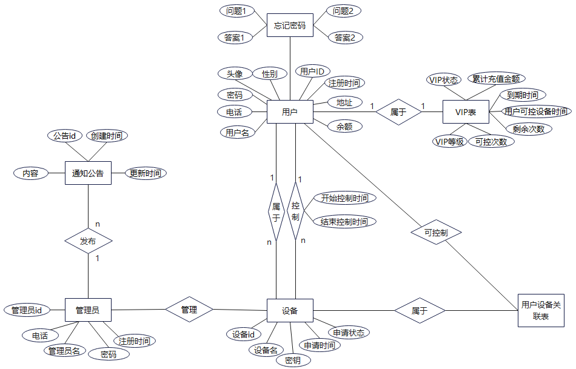

# 跨时空控制台

## 介绍

跨时空控制台是一款创新性的远程控制项目，旨在实现用户对远程电脑的全方位操控。无论身处何地，用户均可通过Web端实现对目标设备的遥控，包括鼠标、键盘等一系列操作，仿佛置身于目标电脑旁。该项目不仅提供了便利的远程管理功能，还具备了安全可靠的特性，确保用户数据和操作的隐私和安全性。跨时空控制台的目标是让用户在任何情况下都能轻松地访问和操控远程设备，为工作和生活带来更大的便利和灵活性。

### 软件架构

该项目开发采用传统B/S架构与C/S架构联合开发

即控制端为web网页、被控端为Windows客户端应用程序

### 部署教程

环境要求：

​	部署之前需要安装Visual Studio代码编译器，包括VS Code、VS2019或更高版本

​	还需要准备一台Linux操作系统的机器，并使用VS2019与之建立SSH连接

Linux系统配置：

​	Linux操作系统需要安装gcc、g++、gdb、cmake、make、rsync、zip、boost以及MySQL开发环境

​	安装命令（以Ubuntu22.04为例）：

​		`sudo apt install gcc g++ gdb make rsync zip libboost-dev`

​		`sudo apt install mysql-server mysql-client libmysqlclient-dev`

部署教程：

+ 将仓库中代码克隆到本地

  `git clone https://gitee.com/shenzhen-hong-kong-rolling/cross-time-and-space-console.git`

+ 前端部署

  首先在[node官网](https://nodejs.org/en)下载node16以上的版本。

  使用`vscode`打开`crossTime-web`，使用终端命令输入`npm install`，静等一会，直至`node_modules`文件下载完成，然后使用`npm run server`命令启动项目

+ 服务器部署

  使用VS2019打开，CrossTime目录下的CrossTime.sln文件，CTRL + B进行项目编译

  编译完成后，在./cross-time-and-space-console-master/CrossTime/CrossTime/bin/x64/Debug目录下即可看到编译好的可执行程序

+ 被控端程序部署

  使用VS2019打开，beCtrlServer目录下的beCtrlServer.sln文件，CTRL + B进行项目编译

  编译完成后，在./cross-time-and-space-console-master/beCtrlServer/x64/Debug目录下即可看到编译好的可执行程序

### 使用说明

+ 首先访问我们[网站](http://81.70.91.154/)，进行账号的注册。

+ 注册并登录网站，即现在就可以对存在的设备进行控制了

+ 如果想将自己的设备成为被控端，请到下载中心下载最新的被控端安装程序

+ 安装运行，登录即可成为被控端

### 参与贡献

+ [LuWeiDong](https://github.com/LaoReng)
+ [LiShiWei](https://gitee.com/shenzhen-hong-kong-rolling)              
+ [WangMeiQi](https://gitee.com/wang-mei-qi)        

## 数据库表设计



用户表（用户id，用户名，头像，密码，性别，地址，电话，注册时间，余额）

忘记密码表（用户id，问题1，答案1，问题2，答案2）

VIP表（用户id，VIP状态，VIP等级，累计充值金额，到期时间，用户可控设备时间，可控次数，剩余次数）

设备表（设备id，设备名，密钥，申请时间，申请状态）

管理员表（管理员id，管理员名，电话，密码，注册时间）

公告表（公告id，内容，创建时间，更新时间）

用户可控设备表（用户id，设备id）

管理员发布公告表（管理员id，公告id）

设备所属用户表（用户id，设备id）

用户控制设备表[历史记录]（控制者id，被控设备id，开始控制时间）

### 对数据表去除冗余表，并对数据表进行优化

由于用户表字段数据太过庞大，所以将用户字段进行拆分为三张表：用户表、忘记密码表以及VIP表

由于设备所属用户表的关系为一对多的关系，所以可以将设备所属用户表和设备表进行合并，去除冗余

由于用户可以控制多个设备并且，也可以对设备进行不同时间段的多次控制，所以将用户控制设备表加上单独的控制id，并不与设备表进行合并处理

**优化后数据表：**

用户表（<u>用户id</u>，用户名，头像，密码，性别，地址，电话，注册时间，余额）

忘记密码表（<span style="text-decoration: underline; text-decoration-style: wavy;"><u>用户id</u></span>，问题1，答案1，问题2，答案2）

VIP表（<span style="text-decoration: underline; text-decoration-style: wavy;"><u>用户id</u></span>，VIP状态，VIP等级，累计充值金额，到期时间，用户可控设备时间，可控次数，剩余次数）

设备表（<u>设备id</u>，设备名，<span style="text-decoration: underline; text-decoration-style: wavy;">所属用户id</span>，密钥，申请时间，申请状态）

管理员表（<u>管理员id</u>，管理员名，电话，密码，注册时间）

公告表（<u>公告id</u>，<span style="text-decoration: underline; text-decoration-style: wavy;">管理员id</span>，内容，创建时间，更新时间）

用户可控设备表（<span style="text-decoration: underline; text-decoration-style: wavy;"><u>用户id，设备id</u></span>）

用户控制设备表[控制设备历史记录]（<u>控制id</u>，<span style="text-decoration: underline; text-decoration-style: wavy;">控制者id，被控设备id</span>，开始控制时间）

### 数据表关系约束

用户表

| 属性     | 类型      | 约束                        |
| -------- | --------- | --------------------------- |
| 用户id   | INT       | primary key, AUTO_INCREMENT |
| 用户名   | VCHAR(40) | not null                    |
| 头像     | VCHAR(40) |                             |
| 密码     | CHAR(15)  | not null                    |
| 性别     | CHAR(4)   |                             |
| 地址     | VCHAR(40) |                             |
| 电话     | CHAR(12)  |                             |
| 注册时间 | DATETIME  | not null                    |
| 余额     | DOUBLE    | not null                    |

忘记密码表

| 属性   | 类型      | 约束                                                         |
| ------ | --------- | ------------------------------------------------------------ |
| 用户id | INT       | primary key, foreign key, ON DELETE CASCADE, ON UPDATE CASCADE |
| 问题1  | VCHAR(40) | not null                                                     |
| 答案1  | VCHAR(40) | not null                                                     |
| 问题2  | VCHAR(40) | not null                                                     |
| 答案2  | VCHAR(40) | not null                                                     |

VIP表

| 属性             | 类型     | 约束                                                         |
| ---------------- | -------- | ------------------------------------------------------------ |
| 用户id           | INT      | primary key, foreign key, ON DELETE CASCADE, ON UPDATE CASCADE |
| VIP状态          | BIT      | not null                                                     |
| VIP等级          | INT      | not null                                                     |
| 累计充值金额     | DOUBLE   | not null                                                     |
| 到期时间         | DATETIME | not null                                                     |
| 用户可控设备时间 | INT      | not null                                                     |
| 可控次数         | INT      | not null                                                     |
| 剩余次数         | INT      | not null                                                     |

设备表

| 属性       | 类型      | 约束                                              |
| ---------- | --------- | ------------------------------------------------- |
| 设备id     | INT       | primary key, AUTO_INCREMENT                       |
| 设备名     | VCHAR(40) | not null                                          |
| 所属用户id | INT       | foreign key, ON DELETE CASCADE, ON UPDATE CASCADE |
| 密钥       | VCHAR(40) | not null                                          |
| 申请时间   | DATETIME  | not null                                          |
| 申请状态   | BIT       | not null                                          |

管理员

| 属性     | 类型      | 约束                        |
| -------- | --------- | --------------------------- |
| 管理员id | INT       | primary key, AUTO_INCREMENT |
| 管理员名 | VCHAR(40) | not null                    |
| 电话     | CHAR(12)  | not null                    |
| 密码     | CHAR(15)  | not null                    |
| 注册时间 | DATETIME  | not null                    |

公告表

| 属性     | 类型      | 约束                                              |
| -------- | --------- | ------------------------------------------------- |
| 公告id   | INT       | primary key, AUTO_INCREMENT                       |
| 管理员id | INT       | foreign key, ON DELETE CASCADE, ON UPDATE CASCADE |
| 内容     | VCHAR(40) | not null                                          |
| 创建时间 | DATETIME  | not null                                          |
| 更新时间 | DATETIME  | not null                                          |

用户可控设备表

| 属性   | 类型 | 约束                                                         |
| ------ | ---- | ------------------------------------------------------------ |
| 用户id | INT  | primary key, foreign key, ON DELETE CASCADE, ON UPDATE CASCADE |
| 设备id | INT  | primary key, foreign key, ON DELETE CASCADE, ON UPDATE CASCADE |

用户控制设备表[控制历史记录]

| 属性         | 类型     | 约束                                              |
| ------------ | -------- | ------------------------------------------------- |
| 控制id       | INT      | primary key, AUTO_INCREMENT                       |
| 控制者id     | INT      | foreign key, ON DELETE CASCADE, ON UPDATE CASCADE |
| 设备id       | INT      | foreign key, ON DELETE CASCADE, ON UPDATE CASCADE |
| 开始控制时间 | DATETIME | not null                                          |

### SQL实现

#### 创建数据库

~~~sql
CREATE DATABASE IF NOT EXISTS CrossTime;
~~~

#### 创建数据表

用户表：

~~~sql
CREATE TABLE IF NOT EXISTS `ctuser` (
  `Uid` int NOT NULL AUTO_INCREMENT COMMENT '用户id',
  `Uname` varchar(40) CHARACTER SET utf8mb3 COLLATE utf8mb3_general_ci NOT NULL COMMENT '用户名',
  `Uavatar` varchar(40) CHARACTER SET utf8mb4 COLLATE utf8mb4_0900_ai_ci DEFAULT NULL COMMENT '用户头像',
  `Upassword` char(15) CHARACTER SET utf8mb4 COLLATE utf8mb4_0900_ai_ci NOT NULL COMMENT '密码',
  `Usex` char(4) CHARACTER SET utf8mb4 COLLATE utf8mb4_0900_ai_ci DEFAULT '2' COMMENT '性别',
  `Uaddr` varchar(40) CHARACTER SET utf8mb3 COLLATE utf8mb3_general_ci DEFAULT NULL COMMENT '住址',
  `Uphone` char(12) CHARACTER SET utf8mb4 COLLATE utf8mb4_0900_ai_ci DEFAULT NULL COMMENT '电话',
  `Uregister_time` datetime NOT NULL COMMENT '注册时间',
  `Ubalance` double NOT NULL COMMENT '余额',
  PRIMARY KEY (`Uid`)
) ENGINE=InnoDB AUTO_INCREMENT=1 DEFAULT CHARSET=utf8mb4 COLLATE=utf8mb4_0900_ai_ci;
~~~

忘记密码表：

~~~sql
CREATE TABLE `revert_password` (
  `Uid` int NOT NULL COMMENT '用户id',
  `question1` varchar(40) CHARACTER SET utf8mb4 COLLATE utf8mb4_0900_ai_ci NOT NULL COMMENT '问题1',
  `answer1` varchar(40) CHARACTER SET utf8mb4 COLLATE utf8mb4_0900_ai_ci NOT NULL COMMENT '答案1',
  `question2` varchar(40) CHARACTER SET utf8mb4 COLLATE utf8mb4_0900_ai_ci NOT NULL COMMENT '问题2',
  `answer2` varchar(40) CHARACTER SET utf8mb4 COLLATE utf8mb4_0900_ai_ci NOT NULL COMMENT '答案2',
  PRIMARY KEY (`Uid`),
  CONSTRAINT `ctuser` FOREIGN KEY (`Uid`) REFERENCES `ctuser` (`Uid`) ON DELETE CASCADE ON UPDATE CASCADE
) ENGINE=InnoDB DEFAULT CHARSET=utf8mb4 COLLATE=utf8mb4_0900_ai_ci;
~~~

VIP表：

~~~sql
CREATE TABLE `vip` (
  `Uid` int NOT NULL COMMENT '用户id',
  `status` bit(1) NOT NULL COMMENT 'vip状态',
  `grade` int NOT NULL COMMENT 'vip等级',
  `acc_amount` double NOT NULL COMMENT '累计充值金额',
  `expire_time` datetime NOT NULL COMMENT '到期时间',
  `ctrl_time` int NOT NULL COMMENT '用户可控设备时间',
  `ctrl_num` int NOT NULL COMMENT '可控次数',
  `surplus_num` int NOT NULL COMMENT '剩余次数',
  PRIMARY KEY (`Uid`),
  CONSTRAINT `Uid` FOREIGN KEY (`Uid`) REFERENCES `ctuser` (`Uid`) ON DELETE CASCADE ON UPDATE CASCADE
) ENGINE=InnoDB DEFAULT CHARSET=utf8mb4 COLLATE=utf8mb4_0900_ai_ci;
~~~

设备表：

~~~sql
CREATE TABLE `equipment` (
  `Eid` int NOT NULL AUTO_INCREMENT COMMENT '设备id',
  `Ename` varchar(40) CHARACTER SET utf8mb4 COLLATE utf8mb4_0900_ai_ci NOT NULL COMMENT '设备名',
  `Uid` int NOT NULL COMMENT '所属用户id',
  `secret_key` varchar(40) CHARACTER SET utf8mb4 COLLATE utf8mb4_0900_ai_ci NOT NULL COMMENT '控制密钥',
  `app_time` datetime NOT NULL COMMENT '申请时间',
  `app_status` bit(1) NOT NULL COMMENT '申请状态',
  PRIMARY KEY (`Eid`),
  KEY `belone_id` (`Uid`),
  CONSTRAINT `belone_id` FOREIGN KEY (`Uid`) REFERENCES `ctuser` (`Uid`) ON DELETE CASCADE ON UPDATE CASCADE
) ENGINE=InnoDB DEFAULT CHARSET=utf8mb4 COLLATE=utf8mb4_0900_ai_ci;
~~~

管理员表：

~~~sql
CREATE TABLE `manager` (
  `id` int NOT NULL AUTO_INCREMENT COMMENT '管理员id',
  `name` varchar(40) CHARACTER SET utf8mb4 COLLATE utf8mb4_0900_ai_ci NOT NULL COMMENT '管理员名',
  `phone` char(12) CHARACTER SET utf8mb4 COLLATE utf8mb4_0900_ai_ci NOT NULL COMMENT '电话',
  `password` char(15) CHARACTER SET utf8mb4 COLLATE utf8mb4_0900_ai_ci NOT NULL COMMENT '密码',
  `register_time` datetime NOT NULL COMMENT '注册时间',
  PRIMARY KEY (`id`)
) ENGINE=InnoDB DEFAULT CHARSET=utf8mb4 COLLATE=utf8mb4_0900_ai_ci;
~~~

公告表：

~~~sql
CREATE TABLE `notice` (
  `id` int NOT NULL AUTO_INCREMENT COMMENT '公告id',
  `mid` int DEFAULT NULL COMMENT '发布者id',
  `title` varchar(40) CHARACTER SET utf8mb4 COLLATE utf8mb4_0900_ai_ci NOT NULL COMMENT '标题',
  `content` varchar(40) CHARACTER SET utf8mb4 COLLATE utf8mb4_0900_ai_ci NOT NULL COMMENT '内容',
  `create_time` datetime NOT NULL COMMENT '创建时间',
  `update` datetime NOT NULL COMMENT '更新时间',
  PRIMARY KEY (`id`),
  KEY `mid` (`mid`),
  CONSTRAINT `mid` FOREIGN KEY (`mid`) REFERENCES `manager` (`id`) ON DELETE CASCADE ON UPDATE CASCADE
) ENGINE=InnoDB DEFAULT CHARSET=utf8mb4 COLLATE=utf8mb4_0900_ai_ci;
~~~

用户可控设备表：

~~~sql
CREATE TABLE `user_ctrl_equip` (
  `uid` int NOT NULL COMMENT '用户id',
  `eid` int NOT NULL COMMENT '设备id',
  PRIMARY KEY (`uid`,`eid`),
  KEY `ctrl_eid` (`eid`),
  CONSTRAINT `ctrl_eid` FOREIGN KEY (`eid`) REFERENCES `equipment` (`Eid`) ON DELETE CASCADE ON UPDATE CASCADE,
  CONSTRAINT `ctrl_uid` FOREIGN KEY (`uid`) REFERENCES `ctuser` (`Uid`) ON DELETE CASCADE ON UPDATE CASCADE
) ENGINE=InnoDB DEFAULT CHARSET=utf8mb4 COLLATE=utf8mb4_0900_ai_ci;
~~~

用户控制设备表：

~~~sql
CREATE TABLE IF NOT EXISTS `ctrl_history` (
  `cid` int NOT NULL AUTO_INCREMENT COMMENT '控制历史id',
  `uid` int DEFAULT NULL COMMENT '控制者id',
  `eid` int DEFAULT NULL COMMENT '被控设备id',
  `start_time` datetime NOT NULL COMMENT '开始控制时间',
  PRIMARY KEY (`cid`),
  KEY `his_ctrl_uid` (`uid`),
  KEY `his_ctrl_eid` (`eid`),
  CONSTRAINT `his_ctrl_eid` FOREIGN KEY (`eid`) REFERENCES `equipment` (`Eid`) ON DELETE CASCADE ON UPDATE CASCADE,
  CONSTRAINT `his_ctrl_uid` FOREIGN KEY (`uid`) REFERENCES `ctuser` (`Uid`) ON DELETE CASCADE ON UPDATE CASCADE
) ENGINE=InnoDB DEFAULT CHARSET=utf8mb4 COLLATE=utf8mb4_0900_ai_ci;
~~~

## 数据包格式封装（包括HTTP请求包&应答包）

### 注册数据包

请求：

~~~http
POST /register HTTP/1.1
Host: 192.168.10.132:9668
Content-Type: application/json
User-Agent: Mozilla/5.0 (Windows NT 10.0; Win64; x64) AppleWebKit/537.36 (KHTML, like Gecko) Chrome/89.0.4389.82 Safari/537.36
Accept: application/json

{
	"phone" : "...",           // 手机号
	"username" : "...",        // 用户名
	"password" : "...",        // 密码
	"balance" : ...,           // 余额
	"question1" : "...",       // 问题1
	"answer1" : "...",         // 答案1
	"question2" : "...",       // 问题2
	"answer2" : "...",         // 答案2
	"registerTime" : "..."     // 注册时间 2024-4-6 12:03:59
}
~~~

应答：

~~~http
HTTP/1.1 200 OK
Date: Wed, 03 Apr 2024 10:47:04 GMT
Server: CrossTimeServer/1.0
Content-Type: text/html; charset=utf-8
X-Frame-Options: DENY
Access-Control-Allow-Origin: * // 跨域所用
Access-Control-Allow-Methods: GET, POST, PUT, OPTIONS, DELETE
Access-Control-Max-Age: 3600
Access-Control-Allow-Headers: *
Connection: keep-alive  // 保持长连接所用
Keep-Alive: timeout=100s
Cache-Control: no-cache // 设置浏览器无缓冲所用
Content-Length: [len]
X-Content-Type-Options: nosniff
Referrer-Policy: same-origin

{
	"message" : "...", // 信息
	"status" : 1       // 状态值 1表示成功
}
~~~

### 登录数据包

请求：

~~~http
http://192.168.10.132:9668/login?phone=...&password=...
~~~

应答：

~~~http
HTTP/1.1 200 OK
Date: Wed, 03 Apr 2024 10:47:04 GMT
Server: CrossTimeServer/1.0
Content-Type: text/html; charset=utf-8
X-Frame-Options: DENY
Access-Control-Allow-Origin: * // 跨域所用
Access-Control-Allow-Methods: GET, POST, PUT, OPTIONS, DELETE
Access-Control-Max-Age: 3600
Access-Control-Allow-Headers: *
Connection: keep-alive  // 保持长连接所用
Keep-Alive: timeout=100s
Cache-Control: no-cache // 设置浏览器无缓冲所用
Content-Length: [len]
X-Content-Type-Options: nosniff
Referrer-Policy: same-origin

{
	"message" : "...",
	"status" : 1
}
~~~

### 忘记密码数据包

请求：

~~~http
POST /forgetPassword HTTP/1.1
Host: 192.168.1.6:9668
Content-Type: application/json
User-Agent: Mozilla/5.0 (Windows NT 10.0; Win64; x64) AppleWebKit/537.36 (KHTML, like Gecko) Chrome/89.0.4389.82 Safari/537.36
Content-Length: [len]
Accept: application/json

{
	"phone" : "..."
}
~~~

应答：

~~~http
HTTP/1.1 200 OK
Date: Wed, 03 Apr 2024 10:47:04 GMT
Server: CrossTimeServer/1.0
Content-Type: text/html; charset=utf-8
X-Frame-Options: DENY
Access-Control-Allow-Origin: * // 跨域所用
Access-Control-Allow-Methods: GET, POST, PUT, OPTIONS, DELETE
Access-Control-Max-Age: 3600
Access-Control-Allow-Headers: *
Connection: keep-alive  // 保持长连接所用
Keep-Alive: timeout=100s
Cache-Control: no-cache // 设置浏览器无缓冲所用
Content-Length: [len]
X-Content-Type-Options: nosniff
Referrer-Policy: same-origin

{
	"message" : "...",  // 信息
	"status" : 1,       // 状态值 1表示成功
	"question1" : "...", // 问题1
	"question2" : "..."  // 问题2
}
~~~

### 验证答案数据包

请求：

~~~http
POST /verifyAnswer HTTP/1.1
Host: 192.168.1.6:9668
Content-Type: application/json
User-Agent: Mozilla/5.0 (Windows NT 10.0; Win64; x64) AppleWebKit/537.36 (KHTML, like Gecko) Chrome/89.0.4389.82 Safari/537.36
Content-Length: [len]
Accept: application/json

{
	"phone" : "...",
	"answer1" : "...",
	"answer2" : "..."
}
~~~

应答：

~~~http
HTTP/1.1 200 OK
Date: Wed, 03 Apr 2024 10:47:04 GMT
Server: CrossTimeServer/1.0
Content-Type: text/html; charset=utf-8
X-Frame-Options: DENY
Access-Control-Allow-Origin: * // 跨域所用
Access-Control-Allow-Methods: GET, POST, PUT, OPTIONS, DELETE
Access-Control-Max-Age: 3600
Access-Control-Allow-Headers: *
Connection: keep-alive  // 保持长连接所用
Keep-Alive: timeout=100s
Cache-Control: no-cache // 设置浏览器无缓冲所用
Content-Length: [len]
X-Content-Type-Options: nosniff
Referrer-Policy: same-origin

{
	"message" : "...", // 答案是否正确的信息
	"status" : 1, // 状态 1表示问题回答正确
	"password" : "..." // 密码
}
~~~

### 获取个人信息

请求：

~~~http
http://192.168.10.132:9668/getUserInfo
~~~

应答：

~~~http
HTTP/1.1 200 OK
Date: Wed, 03 Apr 2024 10:47:04 GMT
Server: CrossTimeServer/1.0
Content-Type: text/html; charset=utf-8
X-Frame-Options: DENY
Access-Control-Allow-Origin: * // 跨域所用
Access-Control-Allow-Methods: GET, POST, PUT, OPTIONS, DELETE
Access-Control-Max-Age: 3600
Access-Control-Allow-Headers: *
Connection: keep-alive  // 保持长连接所用
Keep-Alive: timeout=100s
Cache-Control: no-cache // 设置浏览器无缓冲所用
Content-Length: [len]
X-Content-Type-Options: nosniff
Referrer-Policy: same-origin

{
	"message" : "...", // 答案是否正确的信息
	"status" : 1, // 状态 1表示信息获取成功
	"avatar" : "...", // 头像
	"name" : "...", // 用户名
	"password" : "...", // 密码
	"sex" : "...", // 性别 1表示男 0表示女
	"addr" : "...", // 住址
	"phone" : "...", // 手机号
	"registerTime" : "...", // 注册时间
	"balance" : "..." // 余额
}
~~~

### 修改个人信息

请求：

~~~http
POST /updateUserInfo HTTP/1.1
Host: 192.168.1.6:9668
Content-Type: application/json
User-Agent: Mozilla/5.0 (Windows NT 10.0; Win64; x64) AppleWebKit/537.36 (KHTML, like Gecko) Chrome/89.0.4389.82 Safari/537.36
Content-Length: [len]
Accept: application/json

{
	// 修改的字段及字段值
}
~~~

应答：

~~~http
HTTP/1.1 200 OK
Date: Wed, 03 Apr 2024 10:47:04 GMT
Server: CrossTimeServer/1.0
Content-Type: text/html; charset=utf-8
X-Frame-Options: DENY
Access-Control-Allow-Origin: * // 跨域所用
Access-Control-Allow-Methods: GET, POST, PUT, OPTIONS, DELETE
Access-Control-Max-Age: 3600
Access-Control-Allow-Headers: *
Connection: keep-alive  // 保持长连接所用
Keep-Alive: timeout=100s
Cache-Control: no-cache // 设置浏览器无缓冲所用
Content-Length: [len]
X-Content-Type-Options: nosniff
Referrer-Policy: same-origin

{
	"message" : "...",
	"status" : 1
}
~~~

### 获取最新公告数据包

请求：

~~~http
http://192.168.10.132:9668/getNewNotice
~~~

应答：

~~~http
HTTP/1.1 200 OK
Date: Wed, 03 Apr 2024 10:47:04 GMT
Server: CrossTimeServer/1.0
Content-Type: text/html; charset=utf-8
X-Frame-Options: DENY
Access-Control-Allow-Origin: * // 跨域所用
Access-Control-Allow-Methods: GET, POST, PUT, OPTIONS, DELETE
Access-Control-Max-Age: 3600
Access-Control-Allow-Headers: *
Connection: keep-alive  // 保持长连接所用
Keep-Alive: timeout=100s
Cache-Control: no-cache // 设置浏览器无缓冲所用
Content-Length: [len]
X-Content-Type-Options: nosniff
Referrer-Policy: same-origin

{
	"message" : "...",
	"status" : 1,
	"content" : "..."
}
~~~

### 获取所有公告数据包

请求：

~~~http
http://192.168.10.132:9668/getAllNotice
~~~

应答：

~~~http
HTTP/1.1 200 OK
Date: Wed, 03 Apr 2024 10:47:04 GMT
Server: CrossTimeServer/1.0
Content-Type: text/html; charset=utf-8
X-Frame-Options: DENY
Access-Control-Allow-Origin: * // 跨域所用
Access-Control-Allow-Methods: GET, POST, PUT, OPTIONS, DELETE
Access-Control-Max-Age: 3600
Access-Control-Allow-Headers: *
Connection: keep-alive  // 保持长连接所用
Keep-Alive: timeout=100s
Cache-Control: no-cache // 设置浏览器无缓冲所用
Content-Length: [len]
X-Content-Type-Options: nosniff
Referrer-Policy: same-origin

{
	"message" : "...",
	"status" : 1,
	"total" : ..., 
	"notice" : [
		{
			"id" : ...,
			"title" : "...", // 标题
			"message" : "...", // 公告内容
			"createdAt" : "..."  // 发布时间
		},
		...
	]
}
~~~

### 被控端上线数据包

请求：

~~~http
GET /bectrlOnline HTTP/1.1
Host: 192.168.1.6:9668
Content-Type: application/json
User-Agent: Mozilla/5.0 (Windows NT 10.0; Win64; x64) AppleWebKit/537.36 (KHTML, like Gecko) Chrome/89.0.4389.82 Safari/537.36
Content-Length: [len]
Accept: application/json

{
	"equipName" : "...",
	"width" : "...",
	"height" : "...",
	"phone" : "...",
	"password" : "..."
}
~~~

应答：

~~~http
HTTP/1.1 200 OK
Date: Wed, 03 Apr 2024 10:47:04 GMT
Server: CrossTimeServer/1.0
Content-Type: text/html; charset=utf-8
X-Frame-Options: DENY
Access-Control-Allow-Origin: * // 跨域所用
Access-Control-Allow-Methods: GET, POST, PUT, OPTIONS, DELETE
Access-Control-Max-Age: 3600
Access-Control-Allow-Headers: *
Connection: keep-alive  // 保持长连接所用
Keep-Alive: timeout=100s
Cache-Control: no-cache // 设置浏览器无缓冲所用
Content-Length: [len]
X-Content-Type-Options: nosniff
Referrer-Policy: same-origin

{
	"message" : "...",
	"status" : 0
}
~~~

### 获取设备列表数据包

请求：

~~~http
http://192.168.10.132:9668/equipmentlist
~~~

应答：

~~~http
HTTP/1.1 200 OK
Date: Wed, 03 Apr 2024 10:47:04 GMT
Server: CrossTimeServer/1.0
Content-Type: text/html; charset=utf-8
X-Frame-Options: DENY
Access-Control-Allow-Origin: * // 跨域所用
Access-Control-Allow-Methods: GET, POST, PUT, OPTIONS, DELETE
Access-Control-Max-Age: 3600
Access-Control-Allow-Headers: *
Connection: keep-alive  // 保持长连接所用
Keep-Alive: timeout=100s
Cache-Control: no-cache // 设置浏览器无缓冲所用
Content-Length: [len]
X-Content-Type-Options: nosniff
Referrer-Policy: same-origin

{
	"totalNumber" : ... ,  // 总设备数
	"equipments" : [
		{

			"name": "...",  // 设备名称
			"ip" : "...",   // 设备ip地址
			"eStatus" : ... // 设备状态1 在线 2繁忙
		},
		{
			"name" : ...,
			...
		},
		...
	]
}
~~~

### 发起设备控制数据包

请求：

~~~http
POST /startEquipmentCtrl HTTP/1.1
Host: 192.168.10.132:9668
Content-Type: application/json
User-Agent: Mozilla/5.0 (Windows NT 10.0; Win64; x64) AppleWebKit/537.36 (KHTML, like Gecko) Chrome/89.0.4389.82 Safari/537.36
Accept: application/json

{
	"ctrlerPhone" : "...",     // 控制者的手机号
	"bectrlEquipName" : "...", // 被控设备名称
	"startCtrlTime" : "..."    // 开始控制的时间戳
	
}
~~~

应答：

~~~http
HTTP/1.1 200 OK
Date: Wed, 03 Apr 2024 10:47:04 GMT
Server: CrossTimeServer/1.0
Content-Type: text/html; charset=utf-8
X-Frame-Options: DENY
Access-Control-Allow-Origin: * // 跨域所用
Access-Control-Allow-Methods: GET, POST, PUT, OPTIONS, DELETE
Access-Control-Max-Age: 3600
Access-Control-Allow-Headers: *
Connection: keep-alive  // 保持长连接所用
Keep-Alive: timeout=100s
Cache-Control: no-cache // 设置浏览器无缓冲所用
Content-Length: [len]
X-Content-Type-Options: nosniff
Referrer-Policy: same-origin

{
	"imageDir" : "...", // 获取图片的位置
	"eStatus" : "...",  // 设备当前的状态
	"CtrlTime" : "..."  // 用户可控设备时间 10表示10分钟
	
}
~~~

### 停止设备控制数据包

请求：

~~~http
POST /endEquipmentCtrl HTTP/1.1
Host: 192.168.10.132:9668
Content-Type: application/json
User-Agent: Mozilla/5.0 (Windows NT 10.0; Win64; x64) AppleWebKit/537.36 (KHTML, like Gecko) Chrome/89.0.4389.82 Safari/537.36
Accept: application/json

{
	"bectrlEquipName" : "...", // 要关闭被控设备的名称
}
~~~

应答：

~~~http
HTTP/1.1 200 OK
Date: Wed, 03 Apr 2024 10:47:04 GMT
Server: CrossTimeServer/1.0
Content-Type: text/html; charset=utf-8
X-Frame-Options: DENY
Access-Control-Allow-Origin: * // 跨域所用
Access-Control-Allow-Methods: GET, POST, PUT, OPTIONS, DELETE
Access-Control-Max-Age: 3600
Access-Control-Allow-Headers: *
Connection: keep-alive  // 保持长连接所用
Keep-Alive: timeout=100s
Cache-Control: no-cache // 设置浏览器无缓冲所用
Content-Length: [len]
X-Content-Type-Options: nosniff
Referrer-Policy: same-origin

{
	"message" : "...",
	"status" : ...   1停止成功  2
}
~~~

### 鼠标键盘事件数据包

请求：

~~~http
POST /ctrlEvent HTTP/1.1
Host: 192.168.10.132:9668
Content-Type: application/json
User-Agent: Mozilla/5.0 (Windows NT 10.0; Win64; x64) AppleWebKit/537.36 (KHTML, like Gecko) Chrome/89.0.4389.82 Safari/537.36
Accept: application/json

{
	"bectrlEquipName" : "...",    // 被控设备名称
	"EventType" : ...,            // 事件的类型（鼠标事件 / 键盘事件）   1表示鼠标事件 2表示键盘事件
	"MousePoint" : {"x" : ..., "y" : ...},        // 光标位置
	"operation" : ...,            // 鼠标键盘事件类型（[按下 / 抬起 / 滚动][左键 / 中键 / 右键](后面只用于鼠标)）  0b00010000表示按下 0b00100000表示抬起 0b01000000表示滚动 0b00000001表示右键 0b00000010表示中键 0b00000100表示左键
	"Value" : ...              // 按下的键值
}
~~~

应答：

~~~http
HTTP/1.1 200 OK
Date: Wed, 03 Apr 2024 10:47:04 GMT
Server: CrossTimeServer/1.0
Content-Type: text/html; charset=utf-8
X-Frame-Options: DENY
Access-Control-Allow-Origin: * // 跨域所用
Access-Control-Allow-Methods: GET, POST, PUT, OPTIONS, DELETE
Access-Control-Max-Age: 3600
Access-Control-Allow-Headers: *
Connection: keep-alive  // 保持长连接所用
Keep-Alive: timeout=100s
Cache-Control: no-cache // 设置浏览器无缓冲所用
Content-Length: [len]
X-Content-Type-Options: nosniff
Referrer-Policy: same-origin

~~~

键盘事件映射表：

|            按键             | 十六进制值 | 十进制值 |
| :-------------------------: | :--------: | :------: |
|    BACKSPACE键（删除键）    |    0X08    |    8     |
|             TAB             |    0X09    |    9     |
|       Enter键（回车）       |    0X0D    |    13    |
|           SHIFT键           |    0X10    |    16    |
|           ctrl键            |    0X11    |    17    |
|            ALT键            |    0X12    |    18    |
|           PAUSE键           |    0X13    |    19    |
| CAPS LOCK键（大小写锁定键） |    0X14    |    20    |
|            ESC键            |    0X1B    |    27    |
|           空格键            |    0X20    |    32    |
|          PAGE UP键          |    0X21    |    33    |
|         PAGE DOWN键         |    0X22    |    34    |
|            END键            |    0X23    |    35    |
|           HOME键            |    0X24    |    36    |
|   LEFT ARROW键（左箭头）    |    0X25    |    37    |
|    UP ARROW键（上箭头）     |    0X26    |    38    |
|   RIGHT ARROW键（右箭头）   |    0X27    |    39    |
|   DOWN ARROW键（下箭头）    |    0X28    |    40    |
|          SELECT键           |    0X29    |    41    |
|           PRINT键           |    0X2A    |    42    |
|          EXECUTE键          |    0X2B    |    43    |
|       PRINT SCREEN键        |    0X2C    |    44    |
|          INSERT键           |    0X2D    |    45    |
|          DELETE键           |    0X2E    |    46    |
|           HELP键            |    0X2F    |    47    |
|             0键             |    0X30    |    48    |
|             1键             |    0X31    |    49    |
|             2键             |    0X32    |    50    |
|             3键             |    0X33    |    51    |
|             4键             |    0X34    |    52    |
|             5键             |    0X35    |    53    |
|             6键             |    0X36    |    54    |
|             7键             |    0X37    |    55    |
|             8键             |    0X38    |    56    |
|             9键             |    0X39    |    57    |
|             A键             |    0X41    |    65    |
|             B键             |    0X42    |    66    |
|             C键             |    0X43    |    67    |
|             D键             |    0X44    |    68    |
|             E键             |    0X45    |    69    |
|             F键             |    0X46    |    70    |
|             G键             |    0X47    |    71    |
|             H键             |    0X48    |    72    |
|             I键             |    0X49    |    73    |
|             J键             |    0X4A    |    74    |
|             K键             |    0X4B    |    75    |
|             L键             |    0X4C    |    76    |
|             M键             |    0X4D    |    77    |
|             N键             |    0X4E    |    78    |
|             O键             |    0X4F    |    79    |
|             P键             |    0X50    |    80    |
|             Q键             |    0X51    |    81    |
|             R键             |    0X52    |    82    |
|             S键             |    0X53    |    83    |
|             T键             |    0X54    |    84    |
|             U键             |    0X55    |    85    |
|             V键             |    0X56    |    86    |
|             W键             |    0X57    |    87    |
|             X键             |    0X58    |    88    |
|             Y键             |    0X59    |    89    |
|             Z键             |    0X5A    |    90    |
|            左win            |    0X5B    |    91    |
|            右win            |    0X5C    |    92    |
|         数字键盘0键         |    0X60    |    96    |
|         数字键盘1键         |    0X61    |    97    |
|         数字键盘2键         |    0X62    |    98    |
|         数字键盘3键         |    0X63    |    99    |
|         数字键盘4键         |    0X64    |   100    |
|         数字键盘5键         |    0X65    |   101    |
|         数字键盘6键         |    0X66    |   102    |
|         数字键盘7键         |    0X67    |   103    |
|         数字键盘8键         |    0X68    |   104    |
|         数字键盘9键         |    0X69    |   105    |
|           乘号键            |    0X6A    |   106    |
|           加号键            |    0X6B    |   107    |
|          分隔符键           |    0X6C    |   108    |
|           减号键            |    0X6D    |   109    |
|           句点键            |    0X6E    |   110    |
|           除号键            |    0X6F    |   111    |
|            F1键             |    0X70    |   112    |
|            F2键             |    0X71    |   113    |
|            F3键             |    0X72    |   114    |
|            F4键             |    0X73    |   115    |
|            F5键             |    0X74    |   116    |
|            F6键             |    0X75    |   117    |
|            F7键             |    0X76    |   118    |
|            F8键             |    0X77    |   119    |
|            F9键             |    0X78    |   120    |
|            F10键            |    0X79    |   121    |
|            F11键            |    0X7A    |   122    |
|            F12键            |    0X7B    |   123    |
|            F13键            |    0X7C    |   124    |
|            F14键            |    0X7D    |   125    |
|            F15键            |    0X7E    |   126    |
|            F16键            |    0X7F    |   127    |
|            F17键            |    0X80    |   128    |
|            F18键            |    0X81    |   129    |
|            F19键            |    0X82    |   130    |
|            F20键            |    0X83    |   131    |
|            F21键            |    0X84    |   132    |
|            F22键            |    0X85    |   133    |
|            F23键            |    0X86    |   134    |
|            F24键            |    0X87    |   135    |
|         NUM LOCK键          |    0X90    |   144    |
|        SCROLL LOCK键        |    0X91    |   145    |
|           左shift           |    0XA0    |   160    |
|           右shift           |    0XA1    |   161    |
|           左ctrl            |    0XA2    |   162    |
|           右ctrl            |    0XA3    |   163    |
|            左ALT            |    0XA4    |   164    |
|            右ALT            |    0XA5    |   165    |

### 获取指定目录下的文件和文件夹

请求：

~~~http
GET /getFileInfo HTTP/1.1
Host: 192.168.10.132:9668
Content-Type: application/json
User-Agent: Mozilla/5.0 (Windows NT 10.0; Win64; x64) AppleWebKit/537.36 (KHTML, like Gecko) Chrome/89.0.4389.82 Safari/537.36
Accept: application/json

{
	"GetDir" : "..."    // 要获取的指定目录
}
~~~

应答：

~~~http
HTTP/1.1 200 OK
Date: Wed, 03 Apr 2024 10:47:04 GMT
Server: CrossTimeServer/1.0
Content-Type: text/html; charset=utf-8
X-Frame-Options: DENY
Access-Control-Allow-Origin: * // 跨域所用
Access-Control-Allow-Methods: GET, POST, PUT, OPTIONS, DELETE
Access-Control-Max-Age: 3600
Access-Control-Allow-Headers: *
Connection: keep-alive  // 保持长连接所用
Keep-Alive: timeout=100s
Cache-Control: no-cache // 设置浏览器无缓冲所用
Content-Length: [len]
X-Content-Type-Options: nosniff
Referrer-Policy: same-origin

{
	"message" : "..." ,
	"status" : 1 ,
	"totalNumber" : ... ,
	"equipment" : [
		{
			"fileName": ...,    // 文件名
			"operation" : ...,  // 文件类型（文件夹 / 文件）
			...
		},
		{
			"fileName" : ...,
			...
		},
		...
	]
}
~~~

### 发起文件下载操作数据包

请求：

~~~http
POST /downloadFile HTTP/1.1
Host: 192.168.10.132:9668
Content-Type: application/json
User-Agent: Mozilla/5.0 (Windows NT 10.0; Win64; x64) AppleWebKit/537.36 (KHTML, like Gecko) Chrome/89.0.4389.82 Safari/537.36
Accept: application/json

{
	"FileDir" : "..."   // 要下载的文件的绝对路径
}
~~~

应答：

~~~http
HTTP/1.1 200 OK
Date: Wed, 03 Apr 2024 10:47:04 GMT
Server: CrossTimeServer/1.0
Content-Type: text/html; charset=utf-8
X-Frame-Options: DENY
Access-Control-Allow-Origin: * // 跨域所用
Access-Control-Allow-Methods: GET, POST, PUT, OPTIONS, DELETE
Access-Control-Max-Age: 3600
Access-Control-Allow-Headers: *
Connection: keep-alive  // 保持长连接所用
Keep-Alive: timeout=100s
Cache-Control: no-cache // 设置浏览器无缓冲所用
Content-Length: [len]
X-Content-Type-Options: nosniff
Referrer-Policy: same-origin

{
	"message" : "...",  // 信息
	"status" : 1,       // 状态值
	"FileSize" : ...    // 文件大小
}
~~~

### 发起文件上传数据包

请求：

~~~http

~~~

应答：

~~~http

~~~

## 跨时空控制台后台

### 管理员注册

> `POST  /back/register`

请求体

```json
{
	"phone" : "...",           // 手机号
	"username" : "...",        // 用户名
	"password" : "...",        // 密码
	"balance" : ...,           // 余额
	"registerTime" : "..."     // 注册时间 2024-4-6 12:03:59
}
```

响应体

```json
{
	"message" : "...", // 信息
	"status" : 1       // 状态值 1表示成功
}
```

### 管理员登录

> `GET /back/login?phone=...&password=...`

响应体

```json
{
	"message" : "...",
	"status" : 1
}
```

### 获取用户列表（分页）

> GET /back/getUserList?page=1&pageSize=10    
>
> page=1代表访问第一页数据
>
> pageSize=10代表每页显示10条数据

响应体

```json
{
	"message":"...",
	"status":1,//成功
	"data"：{
		"list":[
			{
				"id":xxx,
				"avatar":"",//头像
				"name":xxx,//用户名
				"password":"xxx",//密码
				"sex":0|1|2,  //0代表女，1代表男，2代表不愿透露
				"addr":"黑龙江省,哈尔滨市,道外区",
				"phone":"188xxx",
				"balance":"",//余额
				"registerTime" : "...", // 注册时间
				//下面可忽略
				"vipStatus":1|0, //vip的状态，1代表激活，0代表未激活
				"vipLevel":1|2|3|4|5, //vip的等级  1 2 3 4 5级
				"totalRecharge":"",//累计充值
				"expirationDate":"2022-12-22 12:00:00" //vip到期时间
				"deviceControlTime","" // 设备可控天数
				"controlCount":xxx,//可控次数
				"remainingCount":xxx,//剩余次数
			},
			{
			...
			},
			...
		],
		total://总数
	}
}
```

### 修改用户信息

> POST /back/updateInfo

请求体

```json
{
	id:"xxx",//用户的id
	//修改的字段
}
```

响应体

```json
{
	"message" : "...",
	"status" : 1
}
```

### 删除用户信息

> DELETE /back/deleteUser?id = xxx

```json
{
	"message" : "...",
	"status" : 1
}
```

### 通知发布

> POST /back/issueNotice

请求体

```json
{
	"title":"通知标题",
	"message":"通知内容",
	"createdAt":"公告发布时间"
}
```

响应体

```json
{
	"message" : "...",
	"status" : 1
}
```

### 通知发布的列表显示

> GET /back/getNoticeList

响应体

```json
{
	"message" : "...",
	"status" : 1,
	"data":{
		"list":[
			{
				"id":"",
				"title":"通知标题",
				"message":"通知内容",
				"createdAt":"公告发布时间"
			},
		...
		],
		total:"xxx"	
	}
}
```

### 通知删除

> DELETE  /back/deleteNotice?id=XXX

响应体

```json
{
	"message" : "...",
	"status" : 1
}
```
