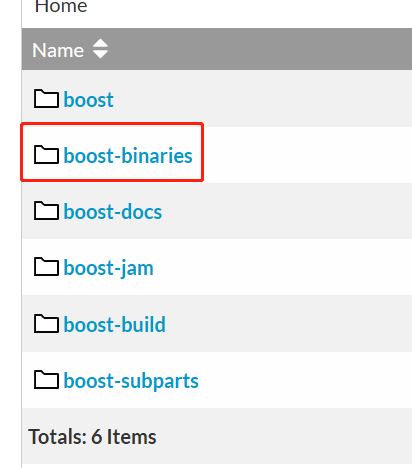
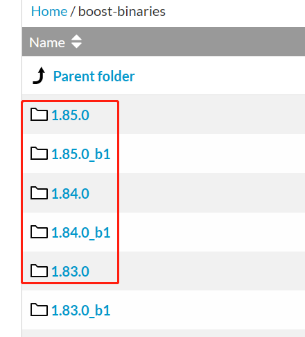
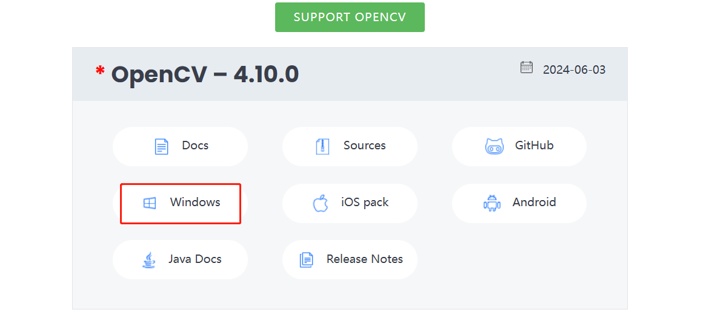
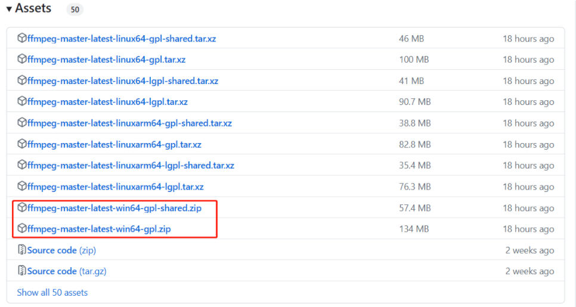
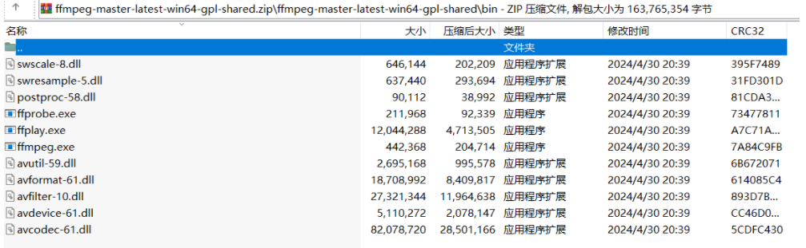
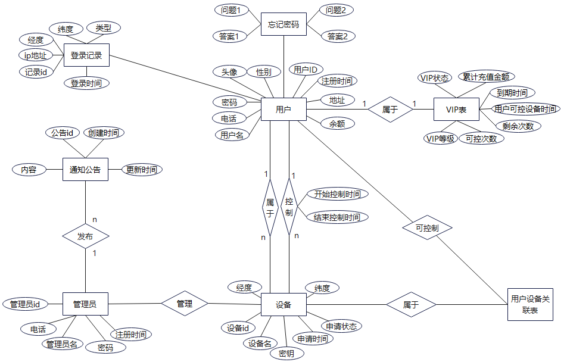
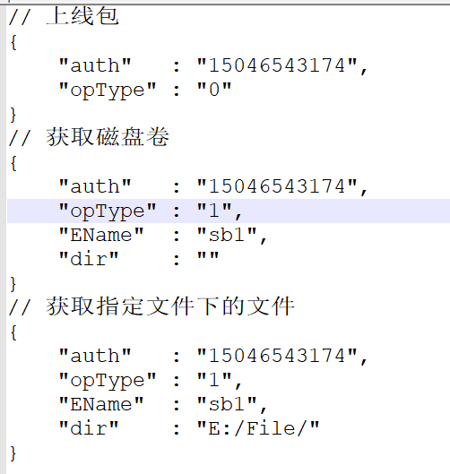

# 跨时空控制台—基于Web的远程设备监控系统

## 介绍

​	跨时空控制台是一款创新性的远程控制项目，旨在实现用户对远程电脑的全方位操控。无论身处何地，用户均可通过Web端实现对目标设备的遥控，包括鼠标、键盘等一系列操作，仿佛置身于目标电脑旁。该项目不仅提供了便利的远程管理功能，还具备了安全可靠的特性，确保用户数据和操作的隐私和安全性。跨时空控制台的目标是让用户在任何情况下都能轻松地访问和操控远程设备，为工作和生活带来更大的便利和灵活性 

### 软件架构

​	该项目开发采用传统B/S架构与C/S架构联合开发

​	即控制端为web网页、被控端为Windows客户端应用程序

### 部署教程

#### 环境要求：

​	部署之前需要安装Visual Studio代码编译器，包括VS Code、VS2019或更高版本

​	还需要准备一台Linux操作系统的机器，并使用VS2019与之建立SSH连接

​	SSH连接配置参考：https://blog.csdn.net/weixin_64647426/article/details/131341970、https://blog.csdn.net/weixin_64647426/article/details/129319160

#### Windows系统配置：

​	**安装boost库**

​		下载地址：https://sourceforge.net/projects/boost/files/boost-binaries/

​		

​		

​	**安装openCV**

​		下载地址：https://opencv.org/releases/

​		

​	**安装ffmpeg**

​		下载地址：https://github.com/BtbN/FFmpeg-Builds/releases

​		

​	进入页面找对应的版本进行下载，比如我这里是Windows系统要使用ffmpeg进行开发

​	这里包含两个版本，一个是带shared的，一个是不带shared，带shared的版本里面包含ffmpeg的库文件可以对ffmpeg进行再开发，不带shared的版本只包含了ffmpeg的使用工具，我们是要利用ffmpeg来进行我们程序的一个开发所以选择带shared的版本，这里按大家的需要选择就可以

​	下载好后，解压就可以直接使用，ffmpeg的工具就在bin目录下



#### Linux系统配置：

​	Linux操作系统需要安装gcc、g++、gdb、git、cmake、make、rsync、zip、boost、curl、websocketpp以及MySQL开发环境

​	**安装命令（以Ubuntu22.04为例）：**

​		`sudo apt install gcc g++ gdb git cmake make rsync zip libboost-dev curl libcurl4-openssl-dev`

​		`sudo apt install mysql-server mysql-client libmysqlclient-dev`

​		MySQL远程连接配置参考：https://blog.csdn.net/weixin_64647426/article/details/134105615

​	**websocketpp安装命令（以Ubuntu22.04为例）：**

​		克隆websocketpp仓库代码：`git clone https://github.com/zaphoyd/websocketpp.git`

​		进入websocketpp仓库：`cd websocketpp`

​		创建并进入build目录：`mkdir build && cd build`

​		配置项目：`cmake ..`

​		编译项目：`make`

​		安装到系统路径：`sudo make install`

部署教程：

+ 将仓库中代码克隆到本地

  `git clone https://gitee.com/shenzhen-hong-kong-rolling/cross-time-and-space-console.git`

+ 前端部署

  首先在[node官网](https://nodejs.org/en)下载node16以上的版本。

  使用`vscode`打开`crossTime-web`，使用终端命令输入`npm install`，静等一会，直至`node_modules`文件下载完成，然后使用`npm run server`命令启动项目

+ 服务器部署

  使用VS2019打开，CrossTime目录下的CrossTime.sln文件，CTRL + B进行项目编译

  编译完成后，在./cross-time-and-space-console-master/CrossTime/CrossTime/bin/x64/Debug目录下即可看到编译好的可执行程序

+ 被控端程序部署

  使用VS2019打开，beCtrlServer目录下的beCtrlServer.sln文件，CTRL + B进行项目编译

  编译完成后，在./cross-time-and-space-console-master/beCtrlServer/x64/Debug目录下即可看到编译好的可执行程序

### 使用说明

+ 首先访问我们[网站](http://www.ctctrl.nat300.top)，进行账号的注册。

+ 注册并登录网站，即现在就可以对存在的设备进行控制了

+ 如果想将自己的设备成为被控端，请到下载中心下载最新的被控端安装程序

+ 安装运行，登录即可成为被控端

### 参与贡献

+ [LuWeiDong](https://github.com/LaoReng)
+ [LiShiWei](https://gitee.com/shenzhen-hong-kong-rolling)              
+ [WangMeiQi](https://gitee.com/wang-mei-qi)        

## 详细设计

### 数据库表设计



用户表（用户id，用户名，头像，密码，性别，地址，电话，注册时间，余额）

忘记密码表（用户id，问题1，答案1，问题2，答案2）

VIP表（用户id，VIP状态，VIP等级，累计充值金额，到期时间，用户可控设备时间，可控次数，剩余次数）

登录记录表（用户id，ip地址，经度，纬度，登录设备类型，登录时间）

设备表（设备id，设备名，密钥，申请时间，申请状态，经度，纬度）

管理员表（管理员id，管理员名，电话，密码，注册时间）

公告表（公告id，内容，创建时间，更新时间）

用户可控设备表（用户id，设备id）

管理员发布公告表（管理员id，公告id）

设备所属用户表（用户id，设备id）

用户控制设备表[历史记录]（控制者id，被控设备id，开始控制时间）

#### 对数据表去除冗余表，并对数据表进行优化

由于用户表字段数据太过庞大，所以将用户字段进行拆分为三张表：用户表、忘记密码表以及VIP表

由于设备所属用户表的关系为一对多的关系，所以可以将设备所属用户表和设备表进行合并，去除冗余

由于用户可以控制多个设备并且，也可以对设备进行不同时间段的多次控制，所以将用户控制设备表加上单独的控制id，并不与设备表进行合并处理

**优化后数据表：**

用户表（<u>用户id</u>，用户名，头像，密码，性别，地址，电话，注册时间，余额）

忘记密码表（<span style="text-decoration: underline; text-decoration-style: wavy;"><u>用户id</u></span>，问题1，答案1，问题2，答案2）

VIP表（<span style="text-decoration: underline; text-decoration-style: wavy;"><u>用户id</u></span>，VIP状态，VIP等级，累计充值金额，到期时间，用户可控设备时间，可控次数，剩余次数）

登录记录表（<span style="text-decoration: underline; text-decoration-style: wavy;">记录id</span>，<u>用户id</u>，ip地址，经度，纬度，登录设备类型，登录时间）

设备表（<u>设备id</u>，设备名，<span style="text-decoration: underline; text-decoration-style: wavy;">所属用户id</span>，密钥，申请时间，申请状态，经度，纬度）

管理员表（<u>管理员id</u>，管理员名，电话，密码，注册时间）

公告表（<u>公告id</u>，<span style="text-decoration: underline; text-decoration-style: wavy;">管理员id</span>，内容，创建时间，更新时间）

用户可控设备表（<span style="text-decoration: underline; text-decoration-style: wavy;"><u>用户id，设备id</u></span>）

用户控制设备表[控制设备历史记录]（<u>控制id</u>，<span style="text-decoration: underline; text-decoration-style: wavy;">控制者id，被控设备id</span>，开始控制时间）

#### 数据表关系约束

用户表

| 属性     | 类型      | 约束                        |
| -------- | --------- | --------------------------- |
| 用户id   | INT       | primary key, AUTO_INCREMENT |
| 用户名   | VCHAR(40) | not null                    |
| 头像     | VCHAR(40) |                             |
| 密码     | CHAR(15)  | not null                    |
| 性别     | CHAR(4)   |                             |
| 地址     | VCHAR(40) |                             |
| 电话     | CHAR(12)  |                             |
| 注册时间 | DATETIME  | not null                    |
| 余额     | DOUBLE    | not null                    |

忘记密码表

| 属性   | 类型      | 约束                                                         |
| ------ | --------- | ------------------------------------------------------------ |
| 用户id | INT       | primary key, foreign key, ON DELETE CASCADE, ON UPDATE CASCADE |
| 问题1  | VCHAR(40) | not null                                                     |
| 答案1  | VCHAR(40) | not null                                                     |
| 问题2  | VCHAR(40) | not null                                                     |
| 答案2  | VCHAR(40) | not null                                                     |

VIP表

| 属性             | 类型     | 约束                                                         |
| ---------------- | -------- | ------------------------------------------------------------ |
| 用户id           | INT      | primary key, foreign key, ON DELETE CASCADE, ON UPDATE CASCADE |
| VIP状态          | BIT      | not null                                                     |
| VIP等级          | INT      | not null                                                     |
| 累计充值金额     | DOUBLE   | not null                                                     |
| 到期时间         | DATETIME | not null                                                     |
| 用户可控设备时间 | INT      | not null                                                     |
| 可控次数         | INT      | not null                                                     |
| 剩余次数         | INT      | not null                                                     |

登录记录表

| 属性         | 类型      | 约束                                              |
| ------------ | --------- | ------------------------------------------------- |
| 记录id       | INT       | primary key, AUTO_INCREMENT                       |
| 用户id       | INT       | foreign key, ON DELETE CASCADE, ON UPDATE CASCADE |
| ip地址       | VCHAR(40) | not null                                          |
| 经度         | DOUBLE    | not null                                          |
| 纬度         | DOUBLE    | not null                                          |
| 登录设备类型 | VCHAR(40) | not null                                          |
| 登录时间     | DATETIME  | not null                                          |

设备表

| 属性       | 类型      | 约束                                              |
| ---------- | --------- | ------------------------------------------------- |
| 设备id     | INT       | primary key, AUTO_INCREMENT                       |
| 设备名     | VCHAR(40) | not null                                          |
| 所属用户id | INT       | foreign key, ON DELETE CASCADE, ON UPDATE CASCADE |
| 密钥       | VCHAR(40) | not null                                          |
| 申请时间   | DATETIME  | not null                                          |
| 申请状态   | BIT       | not null                                          |
| 经度       | DOUBLE    | not null                                          |
| 纬度       | DOUBLE    | not null                                          |

管理员

| 属性     | 类型      | 约束                        |
| -------- | --------- | --------------------------- |
| 管理员id | INT       | primary key, AUTO_INCREMENT |
| 管理员名 | VCHAR(40) | not null                    |
| 电话     | CHAR(12)  | not null                    |
| 密码     | CHAR(15)  | not null                    |
| 注册时间 | DATETIME  | not null                    |

公告表

| 属性     | 类型      | 约束                                              |
| -------- | --------- | ------------------------------------------------- |
| 公告id   | INT       | primary key, AUTO_INCREMENT                       |
| 管理员id | INT       | foreign key, ON DELETE CASCADE, ON UPDATE CASCADE |
| 内容     | VCHAR(40) | not null                                          |
| 创建时间 | DATETIME  | not null                                          |
| 更新时间 | DATETIME  | not null                                          |

用户可控设备表

| 属性   | 类型 | 约束                                                         |
| ------ | ---- | ------------------------------------------------------------ |
| 用户id | INT  | primary key, foreign key, ON DELETE CASCADE, ON UPDATE CASCADE |
| 设备id | INT  | primary key, foreign key, ON DELETE CASCADE, ON UPDATE CASCADE |

用户控制设备表[控制历史记录]

| 属性         | 类型     | 约束                                              |
| ------------ | -------- | ------------------------------------------------- |
| 控制id       | INT      | primary key, AUTO_INCREMENT                       |
| 控制者id     | INT      | foreign key, ON DELETE CASCADE, ON UPDATE CASCADE |
| 设备id       | INT      | foreign key, ON DELETE CASCADE, ON UPDATE CASCADE |
| 开始控制时间 | DATETIME | not null                                          |

#### SQL实现

##### 创建数据库

~~~sql
CREATE DATABASE IF NOT EXISTS CrossTime;
~~~

##### 创建数据表

用户表：

~~~sql
CREATE TABLE IF NOT EXISTS `ctuser` (
  `Uid` int NOT NULL AUTO_INCREMENT COMMENT '用户id',
  `Uname` varchar(40) CHARACTER SET utf8mb3 COLLATE utf8mb3_general_ci NOT NULL COMMENT '用户名',
  `Uavatar` varchar(40) CHARACTER SET utf8mb4 COLLATE utf8mb4_0900_ai_ci DEFAULT NULL COMMENT '用户头像',
  `Upassword` char(15) CHARACTER SET utf8mb4 COLLATE utf8mb4_0900_ai_ci NOT NULL COMMENT '密码',
  `Usex` char(4) CHARACTER SET utf8mb4 COLLATE utf8mb4_0900_ai_ci DEFAULT '2' COMMENT '性别',
  `Uaddr` varchar(40) CHARACTER SET utf8mb3 COLLATE utf8mb3_general_ci DEFAULT NULL COMMENT '住址',
  `Uphone` char(12) CHARACTER SET utf8mb4 COLLATE utf8mb4_0900_ai_ci DEFAULT NULL COMMENT '电话',
  `Uregister_time` datetime NOT NULL COMMENT '注册时间',
  `Ubalance` double NOT NULL COMMENT '余额',
  PRIMARY KEY (`Uid`)
) ENGINE=InnoDB AUTO_INCREMENT=1 DEFAULT CHARSET=utf8mb4 COLLATE=utf8mb4_0900_ai_ci;
~~~

忘记密码表：

~~~sql
CREATE TABLE `revert_password` (
  `Uid` int NOT NULL COMMENT '用户id',
  `question1` varchar(40) CHARACTER SET utf8mb4 COLLATE utf8mb4_0900_ai_ci NOT NULL COMMENT '问题1',
  `answer1` varchar(40) CHARACTER SET utf8mb4 COLLATE utf8mb4_0900_ai_ci NOT NULL COMMENT '答案1',
  `question2` varchar(40) CHARACTER SET utf8mb4 COLLATE utf8mb4_0900_ai_ci NOT NULL COMMENT '问题2',
  `answer2` varchar(40) CHARACTER SET utf8mb4 COLLATE utf8mb4_0900_ai_ci NOT NULL COMMENT '答案2',
  PRIMARY KEY (`Uid`),
  CONSTRAINT `ctuser` FOREIGN KEY (`Uid`) REFERENCES `ctuser` (`Uid`) ON DELETE CASCADE ON UPDATE CASCADE
) ENGINE=InnoDB DEFAULT CHARSET=utf8mb4 COLLATE=utf8mb4_0900_ai_ci;
~~~

VIP表：

~~~sql
CREATE TABLE `vip` (
  `Uid` int NOT NULL COMMENT '用户id',
  `status` bit(1) NOT NULL COMMENT 'vip状态',
  `grade` int NOT NULL COMMENT 'vip等级',
  `acc_amount` double NOT NULL COMMENT '累计充值金额',
  `expire_time` datetime NOT NULL COMMENT '到期时间',
  `ctrl_time` int NOT NULL COMMENT '用户可控设备时间',
  `ctrl_num` int NOT NULL COMMENT '可控次数',
  `surplus_num` int NOT NULL COMMENT '剩余次数',
  PRIMARY KEY (`Uid`),
  CONSTRAINT `Uid` FOREIGN KEY (`Uid`) REFERENCES `ctuser` (`Uid`) ON DELETE CASCADE ON UPDATE CASCADE
) ENGINE=InnoDB DEFAULT CHARSET=utf8mb4 COLLATE=utf8mb4_0900_ai_ci;
~~~

登录记录表：

~~~sql
CREATE TABLE `ulogin_history` (
  `id` int NOT NULL AUTO_INCREMENT COMMENT '记录id',
  `Uid` int NOT NULL COMMENT '用户id',
  `ipAddr` varchar(40) NOT NULL COMMENT 'ip地址',
  `longitude` double NOT NULL COMMENT '经度',
  `latitude` double NOT NULL COMMENT '纬度',
  `address` varchar(255) NOT NULL COMMENT '登录地点',
  `dtype` varchar(40) NOT NULL COMMENT '登录设备类型',
  `loginTime` datetime NOT NULL COMMENT '登录时间',
  PRIMARY KEY (`id`),
  KEY `userid` (`Uid`),
  CONSTRAINT `userid` FOREIGN KEY (`Uid`) REFERENCES `ctuser` (`Uid`) ON DELETE CASCADE ON UPDATE CASCADE
) ENGINE=InnoDB DEFAULT CHARSET=utf8mb4 COLLATE=utf8mb4_0900_ai_ci;
~~~

设备表：

~~~sql
CREATE TABLE `equipment` (
  `Eid` int NOT NULL AUTO_INCREMENT COMMENT '设备id',
  `Ename` varchar(40) CHARACTER SET utf8mb3 COLLATE utf8mb3_general_ci NOT NULL COMMENT '设备名',
  `Uid` int NOT NULL COMMENT '所属用户id',
  `secret_key` varchar(40) NOT NULL COMMENT '控制密钥',
  `app_time` datetime NOT NULL COMMENT '申请时间',
  `app_status` bit(1) NOT NULL COMMENT '申请状态',
  `longitude` double NOT NULL COMMENT '经度',
  `latitude` double NOT NULL COMMENT '纬度',
  PRIMARY KEY (`Eid`),
  KEY `belone_id` (`Uid`),
  CONSTRAINT `belone_id` FOREIGN KEY (`Uid`) REFERENCES `ctuser` (`Uid`) ON DELETE CASCADE ON UPDATE CASCADE
) ENGINE=InnoDB DEFAULT CHARSET=utf8mb3;
~~~

管理员表：

~~~sql
CREATE TABLE `manager` (
  `id` int NOT NULL AUTO_INCREMENT COMMENT '管理员id',
  `name` varchar(40) CHARACTER SET utf8mb4 COLLATE utf8mb4_0900_ai_ci NOT NULL COMMENT '管理员名',
  `phone` char(12) CHARACTER SET utf8mb4 COLLATE utf8mb4_0900_ai_ci NOT NULL COMMENT '电话',
  `password` char(15) CHARACTER SET utf8mb4 COLLATE utf8mb4_0900_ai_ci NOT NULL COMMENT '密码',
  `register_time` datetime NOT NULL COMMENT '注册时间',
  PRIMARY KEY (`id`)
) ENGINE=InnoDB DEFAULT CHARSET=utf8mb4 COLLATE=utf8mb4_0900_ai_ci;
~~~

公告表：

~~~sql
CREATE TABLE `notice` (
  `id` int NOT NULL AUTO_INCREMENT COMMENT '公告id',
  `mid` int DEFAULT NULL COMMENT '发布者id',
  `title` varchar(40) CHARACTER SET utf8mb4 COLLATE utf8mb4_0900_ai_ci NOT NULL COMMENT '标题',
  `content` varchar(40) CHARACTER SET utf8mb4 COLLATE utf8mb4_0900_ai_ci NOT NULL COMMENT '内容',
  `create_time` datetime NOT NULL COMMENT '创建时间',
  `update` datetime NOT NULL COMMENT '更新时间',
  PRIMARY KEY (`id`),
  KEY `mid` (`mid`),
  CONSTRAINT `mid` FOREIGN KEY (`mid`) REFERENCES `manager` (`id`) ON DELETE CASCADE ON UPDATE CASCADE
) ENGINE=InnoDB DEFAULT CHARSET=utf8mb4 COLLATE=utf8mb4_0900_ai_ci;
~~~

用户可控设备表：

~~~sql
CREATE TABLE `user_ctrl_equip` (
  `uid` int NOT NULL COMMENT '用户id',
  `eid` int NOT NULL COMMENT '设备id',
  PRIMARY KEY (`uid`,`eid`),
  KEY `ctrl_eid` (`eid`),
  CONSTRAINT `ctrl_eid` FOREIGN KEY (`eid`) REFERENCES `equipment` (`Eid`) ON DELETE CASCADE ON UPDATE CASCADE,
  CONSTRAINT `ctrl_uid` FOREIGN KEY (`uid`) REFERENCES `ctuser` (`Uid`) ON DELETE CASCADE ON UPDATE CASCADE
) ENGINE=InnoDB DEFAULT CHARSET=utf8mb4 COLLATE=utf8mb4_0900_ai_ci;
~~~

用户控制设备表：

~~~sql
CREATE TABLE IF NOT EXISTS `ctrl_history` (
  `cid` int NOT NULL AUTO_INCREMENT COMMENT '控制历史id',
  `uid` int DEFAULT NULL COMMENT '控制者id',
  `eid` int DEFAULT NULL COMMENT '被控设备id',
  `start_time` datetime NOT NULL COMMENT '开始控制时间',
  PRIMARY KEY (`cid`),
  KEY `his_ctrl_uid` (`uid`),
  KEY `his_ctrl_eid` (`eid`),
  CONSTRAINT `his_ctrl_eid` FOREIGN KEY (`eid`) REFERENCES `equipment` (`Eid`) ON DELETE CASCADE ON UPDATE CASCADE,
  CONSTRAINT `his_ctrl_uid` FOREIGN KEY (`uid`) REFERENCES `ctuser` (`Uid`) ON DELETE CASCADE ON UPDATE CASCADE
) ENGINE=InnoDB DEFAULT CHARSET=utf8mb4 COLLATE=utf8mb4_0900_ai_ci;
~~~

### 控制端前台←→服务器通信协议封装（包括HTTP请求包&应答包）

#### 注册数据包

请求：

~~~http
POST /register HTTP/1.1
Host: 192.168.10.132:9668
Content-Type: application/json
User-Agent: Mozilla/5.0 (Windows NT 10.0; Win64; x64) AppleWebKit/537.36 (KHTML, like Gecko) Chrome/89.0.4389.82 Safari/537.36
Accept: application/json

{
	"phone" : "...",           // 手机号
	"username" : "...",        // 用户名
	"password" : "...",        // 密码
	"balance" : ...,           // 余额
	"question1" : "...",       // 问题1
	"answer1" : "...",         // 答案1
	"question2" : "...",       // 问题2
	"answer2" : "...",         // 答案2
	"registerTime" : "...",     // 注册时间 2024-4-6 12:03:59
	"avatar":"",				//头像
}
~~~

应答：

~~~http
HTTP/1.1 200 OK
Date: Wed, 03 Apr 2024 10:47:04 GMT
Server: CrossTimeServer/1.0
Content-Type: text/html; charset=utf-8
X-Frame-Options: DENY
Access-Control-Allow-Origin: * // 跨域所用
Access-Control-Allow-Methods: GET, POST, PUT, OPTIONS, DELETE
Access-Control-Max-Age: 3600
Access-Control-Allow-Headers: *
Connection: keep-alive  // 保持长连接所用
Keep-Alive: timeout=100s
Cache-Control: no-cache // 设置浏览器无缓冲所用
Content-Length: [len]
X-Content-Type-Options: nosniff
Referrer-Policy: same-origin

{
	"message" : "...", // 信息
	"status" : 1       // 状态值 1表示成功
}
~~~

#### 登录数据包

请求：

~~~http
POST /login HTTP/1.1
Host: 192.168.10.132:9668
Content-Type: application/json
User-Agent: Mozilla/5.0 (Windows NT 10.0; Win64; x64) AppleWebKit/537.36 (KHTML, like Gecko) Chrome/89.0.4389.82 Safari/537.36
Accept: application/json

{
	"phone" : "...",           // 手机号
	"password" : "...",        // 密码
	"ip" : "..."               // 登录设备ip
}
~~~

应答：

~~~http
HTTP/1.1 200 OK
Date: Wed, 03 Apr 2024 10:47:04 GMT
Server: CrossTimeServer/1.0
Content-Type: text/html; charset=utf-8
X-Frame-Options: DENY
Access-Control-Allow-Origin: * // 跨域所用
Access-Control-Allow-Methods: GET, POST, PUT, OPTIONS, DELETE
Access-Control-Max-Age: 3600
Access-Control-Allow-Headers: *
Connection: keep-alive  // 保持长连接所用
Keep-Alive: timeout=100s
Cache-Control: no-cache // 设置浏览器无缓冲所用
Content-Length: [len]
X-Content-Type-Options: nosniff
Referrer-Policy: same-origin

{
	"message" : "...",
	"status" : 1
}
~~~

#### 忘记密码数据包

请求：

~~~http
POST /forgetPassword HTTP/1.1
Host: 192.168.1.6:9668
Content-Type: application/json
User-Agent: Mozilla/5.0 (Windows NT 10.0; Win64; x64) AppleWebKit/537.36 (KHTML, like Gecko) Chrome/89.0.4389.82 Safari/537.36
Content-Length: [len]
Accept: application/json

{
	"phone" : "..."
}
~~~

应答：

~~~http
HTTP/1.1 200 OK
Date: Wed, 03 Apr 2024 10:47:04 GMT
Server: CrossTimeServer/1.0
Content-Type: text/html; charset=utf-8
X-Frame-Options: DENY
Access-Control-Allow-Origin: * // 跨域所用
Access-Control-Allow-Methods: GET, POST, PUT, OPTIONS, DELETE
Access-Control-Max-Age: 3600
Access-Control-Allow-Headers: *
Connection: keep-alive  // 保持长连接所用
Keep-Alive: timeout=100s
Cache-Control: no-cache // 设置浏览器无缓冲所用
Content-Length: [len]
X-Content-Type-Options: nosniff
Referrer-Policy: same-origin

{
	"message" : "...",  // 信息
	"status" : 1,       // 状态值 1表示成功
	"question1" : "...", // 问题1
	"question2" : "..."  // 问题2
}
~~~

#### 获取头像列表

请求

>  GET `/getAvatarList`

响应体

~~~json
{
	"message" : "...",
	"status" : 1,
	"imgList":[
		{
			id:"1",
			url:"/xx.jpg"
		},
		{
			id:"2",
			url:"/xx.jpg"
		}
	]
}
~~~

#### 验证答案数据包

请求：

~~~http
POST /verifyAnswer HTTP/1.1
Host: 192.168.1.6:9668
Content-Type: application/json
User-Agent: Mozilla/5.0 (Windows NT 10.0; Win64; x64) AppleWebKit/537.36 (KHTML, like Gecko) Chrome/89.0.4389.82 Safari/537.36
Content-Length: [len]
Accept: application/json

{
	"phone" : "...",
	"answer1" : "...",
	"answer2" : "..."
}
~~~

应答：

~~~http
HTTP/1.1 200 OK
Date: Wed, 03 Apr 2024 10:47:04 GMT
Server: CrossTimeServer/1.0
Content-Type: text/html; charset=utf-8
X-Frame-Options: DENY
Access-Control-Allow-Origin: * // 跨域所用
Access-Control-Allow-Methods: GET, POST, PUT, OPTIONS, DELETE
Access-Control-Max-Age: 3600
Access-Control-Allow-Headers: *
Connection: keep-alive  // 保持长连接所用
Keep-Alive: timeout=100s
Cache-Control: no-cache // 设置浏览器无缓冲所用
Content-Length: [len]
X-Content-Type-Options: nosniff
Referrer-Policy: same-origin

{
	"message" : "...", // 答案是否正确的信息
	"status" : 1, // 状态 1表示问题回答正确
	"password" : "..." // 密码
}
~~~

#### 获取个人信息

请求：

~~~http
http://192.168.10.132:9668/getUserInfo
~~~

应答：

~~~http
HTTP/1.1 200 OK
Date: Wed, 03 Apr 2024 10:47:04 GMT
Server: CrossTimeServer/1.0
Content-Type: text/html; charset=utf-8
X-Frame-Options: DENY
Access-Control-Allow-Origin: * // 跨域所用
Access-Control-Allow-Methods: GET, POST, PUT, OPTIONS, DELETE
Access-Control-Max-Age: 3600
Access-Control-Allow-Headers: *
Connection: keep-alive  // 保持长连接所用
Keep-Alive: timeout=100s
Cache-Control: no-cache // 设置浏览器无缓冲所用
Content-Length: [len]
X-Content-Type-Options: nosniff
Referrer-Policy: same-origin

{
	"message"        : "...",                // 答案是否正确的信息
	"status"         : 1,                    // 状态 1表示信息获取成功
	"avatar"         : "...",                // 头像
	"name"           : "...",                // 用户名
	"password"       : "...",                // 密码
	"sex"            : "...",                // 性别 1表示男 0表示女
	"addr"           : "...",                // 住址
	"phone"          : "...",                // 手机号
	"registerTime"   : "...",                // 注册时间
	"balance"        : "..."                 // 余额
	"equipCtrlCount" : "",	                 // 设备可控次数
	"expireTime"     : "xxxx-xx-xx xx:xxxx", // 会员到期时间
	"vipgrade"       : "",	                 // vip等级 数据应是1 || 2 ||3 .... ||8
	"accBalance"     : ""	                 // 累计充值金额
}
~~~

#### 修改个人信息

请求：

~~~http
POST /updateUserInfo HTTP/1.1
Host: 192.168.1.6:9668
Content-Type: application/json
User-Agent: Mozilla/5.0 (Windows NT 10.0; Win64; x64) AppleWebKit/537.36 (KHTML, like Gecko) Chrome/89.0.4389.82 Safari/537.36
Content-Length: [len]
Accept: application/json

{
	// 修改的字段及字段值
}
~~~

应答：

~~~http
HTTP/1.1 200 OK
Date: Wed, 03 Apr 2024 10:47:04 GMT
Server: CrossTimeServer/1.0
Content-Type: text/html; charset=utf-8
X-Frame-Options: DENY
Access-Control-Allow-Origin: * // 跨域所用
Access-Control-Allow-Methods: GET, POST, PUT, OPTIONS, DELETE
Access-Control-Max-Age: 3600
Access-Control-Allow-Headers: *
Connection: keep-alive  // 保持长连接所用
Keep-Alive: timeout=100s
Cache-Control: no-cache // 设置浏览器无缓冲所用
Content-Length: [len]
X-Content-Type-Options: nosniff
Referrer-Policy: same-origin

{
	"message" : "...",
	"status" : 1
}
~~~

#### 获取最新公告数据包

请求：

~~~http
http://192.168.10.132:9668/getNewNotice
~~~

应答：

~~~http
HTTP/1.1 200 OK
Date: Wed, 03 Apr 2024 10:47:04 GMT
Server: CrossTimeServer/1.0
Content-Type: text/html; charset=utf-8
X-Frame-Options: DENY
Access-Control-Allow-Origin: * // 跨域所用
Access-Control-Allow-Methods: GET, POST, PUT, OPTIONS, DELETE
Access-Control-Max-Age: 3600
Access-Control-Allow-Headers: *
Connection: keep-alive  // 保持长连接所用
Keep-Alive: timeout=100s
Cache-Control: no-cache // 设置浏览器无缓冲所用
Content-Length: [len]
X-Content-Type-Options: nosniff
Referrer-Policy: same-origin

{
	"message" : "...",
	"status" : 1,
	"content" : "..."
}
~~~

#### 获取所有公告数据包

请求：

~~~http
http://192.168.10.132:9668/getAllNotice
~~~

应答：

~~~http
HTTP/1.1 200 OK
Date: Wed, 03 Apr 2024 10:47:04 GMT
Server: CrossTimeServer/1.0
Content-Type: text/html; charset=utf-8
X-Frame-Options: DENY
Access-Control-Allow-Origin: * // 跨域所用
Access-Control-Allow-Methods: GET, POST, PUT, OPTIONS, DELETE
Access-Control-Max-Age: 3600
Access-Control-Allow-Headers: *
Connection: keep-alive  // 保持长连接所用
Keep-Alive: timeout=100s
Cache-Control: no-cache // 设置浏览器无缓冲所用
Content-Length: [len]
X-Content-Type-Options: nosniff
Referrer-Policy: same-origin

{
	"message" : "...",
	"status" : 1,
	"total" : ..., 
	"notice" : [
		{
			"id" : ...,
			"title" : "...", // 标题
			"message" : "...", // 公告内容
			"createdAt" : "..."  // 发布时间
		},
		...
	]
}
~~~

#### 获取设备列表数据包

请求：

~~~http
http://192.168.10.132:9668/equipmentlist
~~~

应答：

~~~http
HTTP/1.1 200 OK
Date: Wed, 03 Apr 2024 10:47:04 GMT
Server: CrossTimeServer/1.0
Content-Type: text/html; charset=utf-8
X-Frame-Options: DENY
Access-Control-Allow-Origin: * // 跨域所用
Access-Control-Allow-Methods: GET, POST, PUT, OPTIONS, DELETE
Access-Control-Max-Age: 3600
Access-Control-Allow-Headers: *
Connection: keep-alive  // 保持长连接所用
Keep-Alive: timeout=100s
Cache-Control: no-cache // 设置浏览器无缓冲所用
Content-Length: [len]
X-Content-Type-Options: nosniff
Referrer-Policy: same-origin

{
	"totalNumber" : ... ,  // 总设备数
	"equipments"  : [      // 在线设备列表
		{
			"id"      : "...", // 设备id
			"name"    : "...", // 设备名称
			"ip"      : "...", // 设备ip地址
			"type"    : "1/2", // 设备类型 1表示Windows系统  2表示嵌入式设备
			"eStatus" : ...    // 设备状态1 在线 2繁忙
		},
		{
			"id"      : "...", // 设备id
			"name"    : "...", // 设备名称
			...
		},
		...
	]
}
~~~

#### 发起设备控制数据包

请求：

~~~http
POST /startEquipmentCtrl HTTP/1.1
Host: 192.168.10.132:9668
Content-Type: application/json
User-Agent: Mozilla/5.0 (Windows NT 10.0; Win64; x64) AppleWebKit/537.36 (KHTML, like Gecko) Chrome/89.0.4389.82 Safari/537.36
Accept: application/json

{
	"ctrlerPhone"     : "...", // 控制者的手机号
	"bectrlEquipName" : "...", // 被控设备名称
	"startCtrlTime"   : "...", // 开始控制的时间戳
	"key"             : "..."  //开启设备的秘钥 例如：sahkdas123190
}
~~~

应答：

~~~http
HTTP/1.1 200 OK
Date: Wed, 03 Apr 2024 10:47:04 GMT
Server: CrossTimeServer/1.0
Content-Type: text/html; charset=utf-8
X-Frame-Options: DENY
Access-Control-Allow-Origin: * // 跨域所用
Access-Control-Allow-Methods: GET, POST, PUT, OPTIONS, DELETE
Access-Control-Max-Age: 3600
Access-Control-Allow-Headers: *
Connection: keep-alive  // 保持长连接所用
Keep-Alive: timeout=100s
Cache-Control: no-cache // 设置浏览器无缓冲所用
Content-Length: [len]
X-Content-Type-Options: nosniff
Referrer-Policy: same-origin

{
	"imageDir" : "...",  // 获取图片的位置
	"eStatus"  : "...",  // 设备当前的状态
	"CtrlTime" : "..."   // 用户可控设备时间 10表示10分钟
	
}
~~~

#### 停止设备控制数据包

请求：

~~~http
POST /endEquipmentCtrl HTTP/1.1
Host: 192.168.10.132:9668
Content-Type: application/json
User-Agent: Mozilla/5.0 (Windows NT 10.0; Win64; x64) AppleWebKit/537.36 (KHTML, like Gecko) Chrome/89.0.4389.82 Safari/537.36
Accept: application/json

{
	"bectrlEquipName" : "...", // 要关闭被控设备的名称
}
~~~

应答：

~~~http
HTTP/1.1 200 OK
Date: Wed, 03 Apr 2024 10:47:04 GMT
Server: CrossTimeServer/1.0
Content-Type: text/html; charset=utf-8
X-Frame-Options: DENY
Access-Control-Allow-Origin: * // 跨域所用
Access-Control-Allow-Methods: GET, POST, PUT, OPTIONS, DELETE
Access-Control-Max-Age: 3600
Access-Control-Allow-Headers: *
Connection: keep-alive  // 保持长连接所用
Keep-Alive: timeout=100s
Cache-Control: no-cache // 设置浏览器无缓冲所用
Content-Length: [len]
X-Content-Type-Options: nosniff
Referrer-Policy: same-origin

{
	"message" : "...",
	"status" : ...   1停止成功  2
}
~~~

#### 设备操作数据包（关机/重启/删除）

请求：

~~~http
POST /controlEquip HTTP/1.1
Host: 192.168.10.132:9668
Content-Type: application/json
User-Agent: Mozilla/5.0 (Windows NT 10.0; Win64; x64) AppleWebKit/537.36 (KHTML, like Gecko) Chrome/89.0.4389.82 Safari/537.36
Accept: application/json

{
	ctrlerPhone : "",        // 发起控制的手机号
	type        : "1||2||3", // 操作类型 1代表关机，2代表重启，3代表删除设备
	list        : [          // 命令列表
	{	
        "bectrlEquipName" : "...", // 设备名称
        "timeout"         : "..."  // 时间
    },
    ...
   ]
}
~~~

应答：

~~~json
{
	"message" : "...",  // 信息
	"status"  : 1       // 状态值 1表示成功
}
~~~

#### 鼠标键盘事件数据包

请求：

~~~http
POST /ctrlEvent HTTP/1.1
Host: 192.168.10.132:9668
Content-Type: application/json
User-Agent: Mozilla/5.0 (Windows NT 10.0; Win64; x64) AppleWebKit/537.36 (KHTML, like Gecko) Chrome/89.0.4389.82 Safari/537.36
Accept: application/json

{
	"bectrlEquipName" : "...",    // 被控设备名称
	"EventType" : ...,            // 事件的类型（鼠标事件 / 键盘事件）   1表示鼠标事件 2表示键盘事件
	"MousePoint" : {"x" : ..., "y" : ...},        // 光标位置
	"operation" : ...,            // 鼠标键盘事件类型（[按下 / 抬起 / 滚动][左键 / 中键 / 右键](后面只用于鼠标)）  0b00010000表示按下 0b00100000表示抬起 0b01000000表示滚动 0b00000001表示右键 0b00000010表示中键 0b00000100表示左键
	"Value" : ...              // 按下的键值
}
~~~

应答：

~~~http
HTTP/1.1 200 OK
Date: Wed, 03 Apr 2024 10:47:04 GMT
Server: CrossTimeServer/1.0
Content-Type: text/html; charset=utf-8
X-Frame-Options: DENY
Access-Control-Allow-Origin: * // 跨域所用
Access-Control-Allow-Methods: GET, POST, PUT, OPTIONS, DELETE
Access-Control-Max-Age: 3600
Access-Control-Allow-Headers: *
Connection: keep-alive  // 保持长连接所用
Keep-Alive: timeout=100s
Cache-Control: no-cache // 设置浏览器无缓冲所用
Content-Length: [len]
X-Content-Type-Options: nosniff
Referrer-Policy: same-origin
~~~

键盘事件映射表：

|            按键             | 十六进制值 | 十进制值 |
| :-------------------------: | :--------: | :------: |
|    BACKSPACE键（删除键）    |    0X08    |    8     |
|             TAB             |    0X09    |    9     |
|       Enter键（回车）       |    0X0D    |    13    |
|           SHIFT键           |    0X10    |    16    |
|           ctrl键            |    0X11    |    17    |
|            ALT键            |    0X12    |    18    |
|           PAUSE键           |    0X13    |    19    |
| CAPS LOCK键（大小写锁定键） |    0X14    |    20    |
|            ESC键            |    0X1B    |    27    |
|           空格键            |    0X20    |    32    |
|          PAGE UP键          |    0X21    |    33    |
|         PAGE DOWN键         |    0X22    |    34    |
|            END键            |    0X23    |    35    |
|           HOME键            |    0X24    |    36    |
|   LEFT ARROW键（左箭头）    |    0X25    |    37    |
|    UP ARROW键（上箭头）     |    0X26    |    38    |
|   RIGHT ARROW键（右箭头）   |    0X27    |    39    |
|   DOWN ARROW键（下箭头）    |    0X28    |    40    |
|          SELECT键           |    0X29    |    41    |
|           PRINT键           |    0X2A    |    42    |
|          EXECUTE键          |    0X2B    |    43    |
|       PRINT SCREEN键        |    0X2C    |    44    |
|          INSERT键           |    0X2D    |    45    |
|          DELETE键           |    0X2E    |    46    |
|           HELP键            |    0X2F    |    47    |
|             0键             |    0X30    |    48    |
|             1键             |    0X31    |    49    |
|             2键             |    0X32    |    50    |
|             3键             |    0X33    |    51    |
|             4键             |    0X34    |    52    |
|             5键             |    0X35    |    53    |
|             6键             |    0X36    |    54    |
|             7键             |    0X37    |    55    |
|             8键             |    0X38    |    56    |
|             9键             |    0X39    |    57    |
|             A键             |    0X41    |    65    |
|             B键             |    0X42    |    66    |
|             C键             |    0X43    |    67    |
|             D键             |    0X44    |    68    |
|             E键             |    0X45    |    69    |
|             F键             |    0X46    |    70    |
|             G键             |    0X47    |    71    |
|             H键             |    0X48    |    72    |
|             I键             |    0X49    |    73    |
|             J键             |    0X4A    |    74    |
|             K键             |    0X4B    |    75    |
|             L键             |    0X4C    |    76    |
|             M键             |    0X4D    |    77    |
|             N键             |    0X4E    |    78    |
|             O键             |    0X4F    |    79    |
|             P键             |    0X50    |    80    |
|             Q键             |    0X51    |    81    |
|             R键             |    0X52    |    82    |
|             S键             |    0X53    |    83    |
|             T键             |    0X54    |    84    |
|             U键             |    0X55    |    85    |
|             V键             |    0X56    |    86    |
|             W键             |    0X57    |    87    |
|             X键             |    0X58    |    88    |
|             Y键             |    0X59    |    89    |
|             Z键             |    0X5A    |    90    |
|            左win            |    0X5B    |    91    |
|            右win            |    0X5C    |    92    |
|         数字键盘0键         |    0X60    |    96    |
|         数字键盘1键         |    0X61    |    97    |
|         数字键盘2键         |    0X62    |    98    |
|         数字键盘3键         |    0X63    |    99    |
|         数字键盘4键         |    0X64    |   100    |
|         数字键盘5键         |    0X65    |   101    |
|         数字键盘6键         |    0X66    |   102    |
|         数字键盘7键         |    0X67    |   103    |
|         数字键盘8键         |    0X68    |   104    |
|         数字键盘9键         |    0X69    |   105    |
|           乘号键            |    0X6A    |   106    |
|           加号键            |    0X6B    |   107    |
|          分隔符键           |    0X6C    |   108    |
|           减号键            |    0X6D    |   109    |
|           句点键            |    0X6E    |   110    |
|           除号键            |    0X6F    |   111    |
|            F1键             |    0X70    |   112    |
|            F2键             |    0X71    |   113    |
|            F3键             |    0X72    |   114    |
|            F4键             |    0X73    |   115    |
|            F5键             |    0X74    |   116    |
|            F6键             |    0X75    |   117    |
|            F7键             |    0X76    |   118    |
|            F8键             |    0X77    |   119    |
|            F9键             |    0X78    |   120    |
|            F10键            |    0X79    |   121    |
|            F11键            |    0X7A    |   122    |
|            F12键            |    0X7B    |   123    |
|            F13键            |    0X7C    |   124    |
|            F14键            |    0X7D    |   125    |
|            F15键            |    0X7E    |   126    |
|            F16键            |    0X7F    |   127    |
|            F17键            |    0X80    |   128    |
|            F18键            |    0X81    |   129    |
|            F19键            |    0X82    |   130    |
|            F20键            |    0X83    |   131    |
|            F21键            |    0X84    |   132    |
|            F22键            |    0X85    |   133    |
|            F23键            |    0X86    |   134    |
|            F24键            |    0X87    |   135    |
|         NUM LOCK键          |    0X90    |   144    |
|        SCROLL LOCK键        |    0X91    |   145    |
|           左shift           |    0XA0    |   160    |
|           右shift           |    0XA1    |   161    |
|           左ctrl            |    0XA2    |   162    |
|           右ctrl            |    0XA3    |   163    |
|            左ALT            |    0XA4    |   164    |
|            右ALT            |    0XA5    |   165    |

#### 指定设备文件预览操作数据包

请求：

~~~json
{
    "auth"   : "...",             // 手机号
    "opType" : "0/1/2/3/4/5/6/7", // 操作类型 上线/文件浏览/删除/新建/运行/重命名/上传/下载
    "EName"  : "...",             // 设备名
    "dir"    : "..."              // 目录绝对路径
}
~~~

应答：

~~~json
{
    "equip" : "...",  // 表示这个是设备的数据
    "toCtrl" : "...", // 要将数据发送给的控制端
    "list":[
    {
        "type":"1/2",  // 文件/文件夹
        "label":"..."  // 文件名
    },
    ...
    ]
}
~~~

举个🌰：

 

#### 指定设备文件删除、运行、重命名、新建操作数据包

请求：

~~~json
{
    "auth"   : "...",           // 手机号
    "opType" : "0/1/2/3/4/5/6/7", // 操作类型 上线/文件浏览/删除/新建/运行/重命名/上传/下载
    "EName"  : "...",           // 设备名
    "dir"    : "..."            // 目录绝对路径
}
~~~

应答：

~~~json
{
    "toCtrl" : "...", // 要将数据发送给的控制端
    "message" : "...",  // 是否成功失败
    "status"  : "1"     // 状态值
}
~~~

#### 发起文件下载操作数据包

请求：

~~~json
{
    "auth"   : "...",           // 手机号
    "opType" : "0/1/2/3/4/5/6/7", // 操作类型 上线/文件浏览/删除/新建/运行/重命名/上传/下载
    "EName"  : "...",           // 设备名
    "dir"    : "..."            // 文件绝对路径
}
~~~

应答：

~~~json
{
    "toCtrl"    : "...",   // 要将数据发送给的控制端
	"bNext"     : "0/1",   // 是否有后续  0表示没有/1表示有
    "totalSize" : ...,     // 文件总大小
    "Size"      : ...,     // 本次分片大小
    "data"      : "..."    // 文件数据二进制形势
}
~~~

举个🌰：

~~~c++
// 上线包
{
    "auth"   : "15046543174",
    "opType" : "0"
}
// 下载指定路径下文件
{
    "auth"   : "15046543174",
    "opType" : "7",
    "EName"  : "sb1",
    "dir"    : "E:\\hacker.ico"
}
~~~

#### 发起文件上传操作数据包

请求：

~~~json
{
    "auth"   : "...",           // 手机号
    "opType" : "0/1/2/3/4/5/6/7", // 操作类型 上线/文件浏览/删除/新建/运行/重命名/上传/下载
	"EName"  : "...",           // 设备名
    "bNext"  : "0/1",           // 是否有后续  0表示没有/1表示有
    "dir"    : "...",           // 文件绝对路径
    "data"   : "..."            // 文件数据二进制格式
}
~~~

应答：

~~~json
{
    "toCtrl" : "...", // 要将数据发送给的控制端
    "message" : "...",
    "status"  : "1"
}
~~~

#### 数据大屏—访问量及当前用户登录信息数据包

请求：

> `GET /dataSummary`

应答：

~~~json
{
	"message"         : "...",     // 成功success || error
	"status"          : 1,         // 状态值 1表示成功
	"visitTotal"      : xxx,       // 总访问量
	"weekPerDayToatl" : [...,...], // 周访问量（每天）
	"registerCount"   : xxx,       // 注册人数
	"historyList"     : [          // 历史登录记录（当前用户的）
		{
			ip      : "",                   // 登录ip
			date    : "xxx-xx-xx xx:xx:xx", // 历史登录时间
			address : "黑龙江省哈尔滨市"       // 登录地址 省市
		},
        ...
	]
}
~~~

#### 数据大屏—当前在线人数统计数据包

请求：

> `GET /currentOnline`

应答：

~~~json
{
	"message" : "...", // 成功success || error
	"status"  : 1,     // 状态值 1表示成功
	"online"  : xxx    //当前在线数
}
~~~

#### 数据大屏—获取所有注册设备数据包

请求：

> `GET /getEquipAll`

应答：

~~~json
{
    "list":[
       {
           "eName"   : "...",     // 设备名
           "llitude" : [...,...], // 经纬度
           "status"  : 0|1|2      // 状态 0表示离线 1表示在线 2表示正在被控制
       },
       ...
    ]
}
~~~

#### 数据大屏—正被控设备状态指向数据包

请求：

> `GET /ctrlTobeCtrl`

响应：

~~~json
{
    "list":[
         {	
             "coords":[
             	[126.642464, 45.756967], 
             	[119.306239, 26.075302]
             ]	//控制端起点经纬度，被控端终点经纬度
         },
         {
             "coords":[
                 [126.642464, 45.756967], 
                 [119.306239, 26.075302]
             ]	//控制端起点经纬度，被控端终点经纬度
         }
         ...
    ]
}
~~~

#### 数据大屏—获取当前位置的天气数据包

请求：

> `GET /getWeather?ip=...`

受支持API接口：http://api.lolimi.cn/API/weather/?city=北京

受支持API接口：http://api.map.baidu.com/location/ip?ip=111.206.214.37&coor=bd09ll&ak=您的AK

应答：

~~~json
{
  "code": 1,
  "text": "获取成功",
  "data": {
    "city": "大庆",
    "cityEnglish": "daqing",
    "temp": "13",
    "tempn": "14",
    "weather": "晴转多云",
    "wind": "西北风转西风",
    "windSpeed": "3-4级转\u003C3级",
    "time": "2024-05-18 08:00",
    "warning": {

    },
    "current": {
      "city": "大庆",
      "cityEnglish": "daqing",
      "humidity": "24%",
      "wind": "西北风",
      "windSpeed": "2级",
      "visibility": "30km",
      "weather": "多云",
      "weatherEnglish": "Cloudy",
      "temp": "17",
      "fahrenheit": "62.6",
      "air": "30",
      "air_pm25": "30",
      "date": "05月18日(星期六)",
      "time": "17:05",
      "image": "http://api.lolimi.cn/API/weather/cache/image/多云.png"
    },
    "living": [
      {
        "name": "路况指数",
        "index": "干燥",
        "tips": "天气较好，路面较干燥，路况较好。"
      },
      {
        "name": "晨练指数",
        "index": "较适宜",
        "tips": "部分地面较湿滑，选择合适的地点晨练。"
      },
      {
        "name": "空气污染扩散条件指数",
        "index": "良",
        "tips": "气象条件有利于空气污染物扩散。"
      },
      {
        "name": "逛街指数",
        "index": "较适宜",
        "tips": "这种好天气去逛街可使身心畅快放松。"
      },
      {
        "name": "舒适度指数",
        "index": "较舒适",
        "tips": "白天晴好，早晚偏凉，午后舒适。"
      },
      {
        "name": "啤酒指数",
        "index": "较适宜",
        "tips": "适量的饮用啤酒，注意不要过量。"
      },
      {
        "name": "划船指数",
        "index": "较适宜",
        "tips": "风稍大会对划船产生一定影响。"
      },
      {
        "name": "太阳镜指数",
        "index": "必要",
        "tips": "建议佩戴透射比为1级的遮阳镜"
      },
      {
        "name": "紫外线强度指数",
        "index": "很强",
        "tips": "涂擦SPF20以上，PA++护肤品，避强光。"
      },
      {
        "name": "风寒指数",
        "index": "无",
        "tips": "温度未达到风寒所需的低温，稍作防寒准备即可。"
      },
      {
        "name": "穿衣指数",
        "index": "较冷",
        "tips": "建议着厚外套加毛衣等服装。"
      },
      {
        "name": "放风筝指数",
        "index": "适宜",
        "tips": "好天气，放风筝可以舒展筋骨放松身心。"
      },
      {
        "name": "空调开启指数",
        "index": "较少开启",
        "tips": "体感舒适，不需要开启空调。"
      },
      {
        "name": "钓鱼指数",
        "index": "较适宜",
        "tips": "风稍大会对垂钓产生一定影响。"
      },
      {
        "name": "晾晒指数",
        "index": "适宜",
        "tips": "天气不错，抓紧时机让衣物晒太阳吧。"
      },
      {
        "name": "感冒指数",
        "index": "极易发",
        "tips": "强降温，极易感冒。"
      },
      {
        "name": "洗车指数",
        "index": "较适宜",
        "tips": "无雨且风力较小，易保持清洁度。"
      },
      {
        "name": "旅游指数",
        "index": "适宜",
        "tips": "风稍大，但仍可尽情享受大自然风光。"
      },
      {
        "name": "夜生活指数",
        "index": "较适宜",
        "tips": "只要您稍作准备就可以放心外出。"
      },
      {
        "name": "心情指数",
        "index": "好",
        "tips": "好天气会带来一天的好心情。"
      },
      {
        "name": "约会指数",
        "index": "较适宜",
        "tips": "不用担心天气来调皮捣乱而影响了兴致。"
      },
      {
        "name": "运动指数",
        "index": "较适宜",
        "tips": "风力稍强，推荐您进行室内运动。"
      },
      {
        "name": "过敏指数",
        "index": "较易发",
        "tips": "需注意远离过敏源，适当采取防护措施。"
      },
      {
        "name": "美发指数",
        "index": "一般",
        "tips": "注意清洁，建议选用防晒滋润型护发品。"
      },
      {
        "name": "雨伞指数",
        "index": "不带伞",
        "tips": "天气较好，不用带雨伞。"
      },
      {
        "name": "防晒指数",
        "index": "极强",
        "tips": "需涂擦SPF大于20，PA++，护肤品。"
      },
      {
        "name": "化妆指数",
        "index": "防晒",
        "tips": "请选用中性保湿型化妆品。"
      },
      {
        "name": "中暑指数",
        "index": "无中暑风险",
        "tips": "天气不热，在炎炎夏日中十分难得，可以告别暑气漫漫啦~"
      },
      {
        "name": "交通指数",
        "index": "良好",
        "tips": "气象条件良好，车辆可以正常行驶。"
      },
      {
        "name": "干燥指数",
        "index": "干燥",
        "tips": "风速偏大，空气干燥，皮肤水分流失快，应减少皮肤暴露在外面积；多喝水补充身体水分，同时涂抹保湿滋润型护肤品。"
      }
    ]
  }
}
~~~

### 被控端←→服务器通信协议封装（包括HTTP请求包&应答包）

#### 登录数据包

请求：

~~~http
GET /bectrlOnline HTTP/1.1
Host: 192.168.1.6:9668
Content-Type: application/json
User-Agent: Mozilla/5.0 (Windows NT 10.0; Win64; x64) AppleWebKit/537.36 (KHTML, like Gecko) Chrome/89.0.4389.82 Safari/537.36
Content-Length: [len]
Accept: application/json

{
	"equipName" : "...",
	"type" : "1/2",    // 设备类型1表示Windows设备  2表示嵌入式
	"width" : "...",
	"height" : "...",
	"phone" : "...",
	"password" : "..."
}
~~~

应答：

~~~http
HTTP/1.1 200 OK
Date: Wed, 03 Apr 2024 10:47:04 GMT
Server: CrossTimeServer/1.0
Content-Type: text/html; charset=utf-8
X-Frame-Options: DENY
Access-Control-Allow-Origin: * // 跨域所用
Access-Control-Allow-Methods: GET, POST, PUT, OPTIONS, DELETE
Access-Control-Max-Age: 3600
Access-Control-Allow-Headers: *
Connection: keep-alive  // 保持长连接所用
Keep-Alive: timeout=100s
Cache-Control: no-cache // 设置浏览器无缓冲所用
Content-Length: [len]
X-Content-Type-Options: nosniff
Referrer-Policy: same-origin

{
	"message" : "...",
	"status"  : 0
}
~~~

#### 被控端下线

请求：

~~~http
GET /bectrlDownline HTTP/1.1
Host: 192.168.1.6:9668
Content-Type: application/json
User-Agent: Mozilla/5.0 (Windows NT 10.0; Win64; x64) AppleWebKit/537.36 (KHTML, like Gecko) Chrome/89.0.4389.82 Safari/537.36
Content-Length: [len]
Accept: application/json

{
	"equipName" : "..."
}
~~~

应答：

~~~http
HTTP/1.1 200 OK
Date: Wed, 03 Apr 2024 10:47:04 GMT
Server: CrossTimeServer/1.0
Content-Type: text/html; charset=utf-8
X-Frame-Options: DENY
Access-Control-Allow-Origin: * // 跨域所用
Access-Control-Allow-Methods: GET, POST, PUT, OPTIONS, DELETE
Access-Control-Max-Age: 3600
Access-Control-Allow-Headers: *
Connection: keep-alive  // 保持长连接所用
Keep-Alive: timeout=100s
Cache-Control: no-cache // 设置浏览器无缓冲所用
Content-Length: [len]
X-Content-Type-Options: nosniff
Referrer-Policy: same-origin

{
	"message" : "...",
	"status"  : 0
}
~~~

#### 开启屏幕监控数据包

请求：

~~~c++
// [包头][命令号][数字][长度][数据][校验和]
[0xFEFF][1][端口号][length][文件名][校验和]
~~~

应答：

~~~c++
// [包头][命令号][数字][长度][数据][校验和]
[0xFEFF][1][num][length][设备数据][校验和]
~~~

#### 停止屏幕监控数据包

请求：

~~~c++
// [包头][命令号][数字][长度][数据][校验和]
[0xFEFF][2][2][length][NULL][校验和]
~~~

应答：

~~~c++
// [包头][命令号][数字][长度][数据][校验和]
暂无返回数据
~~~

#### 鼠标键盘操作数据包

请求：

~~~c++
// [包头][命令号][数字][长度][数据][校验和]
[0xFEFF][3][3][length][MKEvent数据][校验和]
~~~

应答：

~~~c++
// [包头][命令号][数字][长度][数据][校验和]
暂无返回数据
~~~

#### 设备关机操作数据包

请求：

~~~c++
// [包头][命令号][数字][长度][数据][校验和]
[0xFEFF][4][4][length][NULL][校验和]
~~~

应答：

~~~c++
// [包头][命令号][数字][长度][数据][校验和]
暂无返回数据
~~~

#### 设备重启操作数据包

请求：

~~~c++
// [包头][命令号][数字][长度][数据][校验和]
[0xFEFF][5][5][length][NULL][校验和]
~~~

应答：

~~~c++
// [包头][命令号][数字][长度][数据][校验和]
暂无返回数据
~~~

### CTCtrl后台←→服务器通信协议封装（包括HTTP请求包&应答包）

#### 管理员登录

> `GET /back/login?phone=...&password=...`

响应体

```json
{
	"message" : "...",
	"status" : 1
}
```

#### 获取用户列表(分页)

> GET /back/getUserList?page=1&pageSize=10    
>
> page=1代表访问第一页数据
>
> pageSize=10代表每页显示10条数据

响应体

```json
{
	"message":"...",
	"status":1,//成功
	"data"：{
		"list":[
			{
    			//以下没有的值为-
				"userId"            :"user-xxx",           // 用户id
				"username"          :"xxx",                // 用户名
				"sex"               :0|1|2,                // 0代表女，1代表男，2代表不愿透露
				"address"           :"黑龙江省,哈尔滨市,道外区",// 地址
				"phone"             :"12345678910",        // 手机号
				"registerTime"      :"2024-04-05 20:13:14",// 注册时间
				"vipStatus"         :1|0,                  // vip的状态，1代表激活，0代表未激活
				"vipLevel"          :1|2|3|4|5,            // vip的等级  1 2 3 4 5级
 			    "expirationDate"    :"2022-12-22 12:00:00" // vip到期时间
   			    "balance"           :"$100.00",            // 余额
				"totalRecharge"     :"$500.00",            // 累计充值
				"deviceControlTime" :""                    // 设备可控天数
				"controlCount"      :xxx,                  // 可控次数
				"remainingCount"    :xxx,                  // 剩余次数
    			"forbidden"         :true/false,           // 用户禁用标志 true表示禁用 false表示启用
    			"expire"            :true/false            // 用户停用标志 true表示停用 false表示未停用
			},
			{
			...
			},
			...
		],
		total://总页数
	}
}
```

#### 根据地址筛选用户信息

> GRT /back/searchUserList?address=xxx

响应体

```json
{
	"message":"...",
	"status":1,//成功
	"data"：{
		"list":[
			{
				"userId"            :"user-xxx", //用户id
				"username"          :"xxx",//用户名
				"sex"               :0|1|2,  //0代表女，1代表男，2代表不愿透露
				"address"           :"黑龙江省,哈尔滨市,道外区",
				"phone"             :"12345678910",
				"registerTime"      :"2024-04-05 20:13:14", // 注册时间
    			//以下没有的值为-
				"vipStatus"         :1|0, //vip的状态，1代表激活，0代表未激活
				"vipLevel"          :1|2|3|4|5, //vip的等级  1 2 3 4 5级
 			    "expirationDate"    :"2022-12-22 12:00:00" //vip到期时间
   			    "balance"           :"$100.00",//余额
				"totalRecharge"     :"$500.00",//累计充值
				"deviceControlTime" :"", // 设备可控天数
				"controlCount"      :xxx,//可控次数
				"remainingCount"    :xxx,//剩余次数
			},
			{
			...
			},
			...
		],
	}
}
```

#### 用户删除,禁用,启用接口

> POST /back/operateUser

请求体

```json
{
    "userIds" :["user-xxx", ...],         //用户id
    "type"    :"delete/disabled/enabled"  //删除|禁用|启用
}
```

响应体

```json
{
	"message" : "...",
	"status"  : 1
}
```

#### 获取已同意的设备列表(分页)

> GET /back/getDevicesList?page=1&pageSize=10    
>
> page=1代表访问第一页数据
>
> pageSize=10代表每页显示10条数据

响应体

```json
{
	"message" :"...",
	"status"  :1,    //成功
	"data"    :{
		"list":[
			{
				"devicesId"   : "dev-xxx",          //设备id
          	    "devicesName" : "xxx",              //设备名
       		    "userId"      : "user-xxx",         //所属用户id
       		    "secretKey"   : "1234567890ABCDEF", //秘钥
			},
			...
		],
		total://总页数
	}
}
```

#### 根据用户id筛选已同意的设备信息

> GET /back/searchDevicesList?userId=user-xxx

响应体

```json
{
	"message" : "...",
	"status"  : 1,     //成功
	"data"    : {
		"list":[
			{
				"devicesId"   : "dev-xxx",//设备id
          	    "devicesName" : "xxx",//设备名
       		    "userId"      : "user-xxx",//所属用户id
       		    "secretKey"   : "1234567890ABCDEF",//秘钥
			},
			{
			...
			},
			...
		],
	}
}
```

#### 删除已同意的设备信息

> DELETE /back/deleteDevices

请求体

```json
{
    "devicesIds": ["dev-xxx", ...] //设备id
}
```

响应体

```
{
	"message" : "...",
	"status"  : 1
}
```

#### 获取未处理的申请设备

> GET /back/getApplyDevices
>

响应体

```json
{
	"message":"...",
	"status":1,//成功
	"data"：{
		"list":[
			{
				"devicesId"   : "dev-xxx",             //设备id
          	    "devicesName" : "xxx",                 //设备名
       		    "userId"      : "user-xxx",            //所属用户id
       		    "secretKey"   : "1234567890ABCDEF",    //秘钥
      		    "applyTime"   : "2024-04-05 20:13:14", //申请时间
			},
			...
		],
	}
}
```

#### 处理设备申请

> POST /back/applyDevices
>

请求体

```json
{
    "devicesId" : ["user-xxx", ...], //设备id
    "type"      : "approve/reject"   //同意|拒绝
}
```

响应体

```
{
	"message" : "...",
	"status"  : 1
}
```

#### 获取通知列表(分页)

> GET /back/getNoticeList?page=1&pageSize=10    
>
> page=1代表访问第一页数据
>
> pageSize=10代表每页显示10条数据

响应体

```json
{
	"message" : "...",
	"status" : 1,
	"data":{
		"list":[
			{
				"noticeId":"ad-xxx",//通知id
                "admId":"adm-xxx",//发布的管理员id
				"title":"通知标题",
				"content":"通知内容",
				"createTime":"2024-04-05 20:13:14",//通知创建时间
                "updateTime":"2024-04-05 20:13:14"//通知更新时间,没有更新过的值为-
			},
			...
		],
		total:"xxx"	
	}
}
```

#### 通知发布

> POST /back/issueNotice

请求体

```json
{
    "phone":"12345678910",//手机号
	"title":"通知标题",
	"content":"通知内容",
	"createTime":"2024-04-05 20:13:14"//通知创建时间
}
```

响应体

```json
{
	"message" : "...",
	"status" : 1
}
```

#### 通知更改

> POST  /back/updateNotice

请求体

```json
{
    "noticeId":"ad-xxx",//通知id
	"title":"通知标题", //可选
	"content":"通知内容", //可选
    "updateTime":"2024-04-05 20:13:14"//通知更新时间
}
```

响应体

```json
{
	"message" : "...",
	"status"  : 1
}
```

#### 通知删除

> DELETE  /back/deleteNotice

请求体

```json
{
    "noticeIds": ["ad-xxx", ...]//通知id
}
```

响应体

```
{
	"message" : "...",
	"status"  : 1
}
```

### 跨时空控制台被控端

#### 客户端配置文件样例

该配置文件用来记录用户的一些信息，比如是否记住密码，是否自动登录

比如还有一些设置中的配置的记录

该模块用于解释配置文件中的选项字段的含义

~~~json
{
    "loginCfg" : {  // 登录配置
        "RememberPwd" : 0 || 1,  // 是否记住密码 1表示记住密码
        "AutoLogin"   : 0 || 1,  // 是否自动登录 1表示自动登录
        "Account"     : "...",   // 账号
        "Password"    : "...",   // 密码
    },
    "settingCfg" : {  // 设置配置
        "key" : { // 密钥设置
            value : "...", // 密钥值（控制码）
            customized : 0 | 1   // 是否自定义密钥 1表示自定义
        },
        "selfStarting" : 0 | 1,   // 是否开机自启动 1表示开机自启动
        "adminRun" : 0 | 1,       // 是否以管理员权限运行 1表示是
        "monitoringPQ" : 0 | 1 | 2, // 监控画质 0表示标准 1表示极高 2表示无损画质
        "downloadDir" : "...",      // 下载目录
        "cacheDir" : "...",         // 缓存目录
        "updateType" : 0 | 1        // 软件更新方式 0表示自动更新 1表示有更新时提醒
    }
}
~~~

## 新增需求说明（已部分实现（未完成））

### 6月15日新增功能需求说明：

​	1、设备关机重启新增时间设置，即指定时间后执行响应操作
​		注：支持小数设置，时间段0到5分钟
​	2、新增设备文件预览、上传、下载、删除以及文件执行功能
​	3、新增支持设备状态查看功能（CPU、内存、磁盘......）

## TODO:待完成任务

待接入邮箱消息发送

